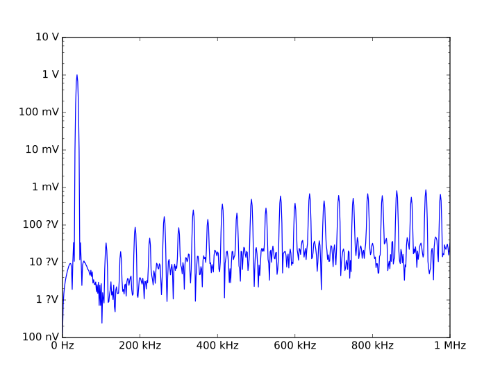

QuantiPhy - Physical Quantities
===============================

| Version: 1.3.0
| Released: 2017-03-19
|

.. image:: https://img.shields.io/travis/KenKundert/quantiphy/master.svg
    :target: https://travis-ci.org/KenKundert/quantiphy

.. image:: https://img.shields.io/coveralls/KenKundert/quantiphy.svg
    :target: https://coveralls.io/r/KenKundert/quantiphy

.. image:: https://img.shields.io/pypi/v/quantiphy.svg
    :target: https://pypi.python.org/pypi/quantiphy

.. image:: https://img.shields.io/pypi/pyversions/quantiphy.svg
    :target: https://pypi.python.org/pypi/quantiphy/

.. image:: https://img.shields.io/pypi/dd/quantiphy.svg
    :target: https://pypi.python.org/pypi/quantiphy/

Use 'pip3 install quantiphy' to install.  Requires Python3.3 or better.
Python2.7 is also supported, however support for unicode units is weak.

Synopsis
--------

The *QuantiPhy* package provides the *Quantity* class that:

1. accepts real values with units in a variety of common forms, including those 
   that include SI scale factors,
2. converts them into an object that is treated as a floating point number in 
   expressions,
3. generally includes the units when printing and by default employs the SI 
   scale factors.
4. Unit conversion is supported when converting to or from quantities.

Introduction
------------

*QuantiPhy* is a light-weight package that allows numbers to be combined with 
units into physical quantities.  Physical quantities are very commonly 
encountered when working with real-world systems when numbers are involved. And 
when encountered, the numbers often use SI scale factors to make them easier to 
read and write.  Surprisingly, most computer languages do not support numbers in 
these forms, meaning that when working with physical quantities, one often has 
to choose what form to use, one that is easy for computers to read or one that 
is easy for humans to read. For example, consider this table of critical 
frequencies needed in jitter tolerance measurements in optical communication:

.. code-block:: python

    >>> table1 = """
    ...     SDH     | Rate          | f1      | f2       | f3      | f4
    ...     --------+---------------+---------+----------+---------+--------
    ...     STM-1   | 155.52 Mb/s   | 500 Hz  | 6.5 kHz  | 65 kHz  | 1.3 MHz
    ...     STM-4   | 622.08 Mb/s   | 1 kHz   | 25 kHz   | 250 kHz | 5 MHz
    ...     STM-16  | 2.48832 Gb/s  | 5 kHz   | 100 kHz  | 1 MHz   | 20 MHz
    ...     STM-64  | 9.95328 Gb/s  | 20 kHz  | 400 kHz  | 4 MHz   | 80 MHz
    ...     STM-256 | 39.81312 Gb/s | 80 kHz  | 1.92 MHz | 16 MHz  | 320 MHz
    ... """

This table was formatted to be easily read by humans. If it were formatted for 
computers, the numbers would be given without units and in exponential notation 
because they have dramatically different sizes. For example, it might look like 
this:

.. code-block:: python

    >>> table2 = """
    ...     SDH     | Rate (b/s)    | f1 (Hz) | f2 (Hz)  | f3 (Hz) | f4 (Hz)
    ...     --------+---------------+---------+----------+---------+--------
    ...     STM-1   | 1.5552e8      | 5e2     | 6.5e3    | 6.5e3   | 1.3e6
    ...     STM-4   | 6.2208e8      | 1e3     | 2.5e3    | 2.5e5   | 5e6
    ...     STM-16  | 2.48832e9     | 5e3     | 1e5      | 1e6     | 2e7
    ...     STM-64  | 9.95328e9     | 2e4     | 4e5      | 4e6     | 8e7
    ...     STM-256 | 3.981312e10   | 8e4     | 1.92e6   | 1.6e7   | 3.20e8
    ... """

This contains the same information, but it is much harder for humans to read and 
interpret.  Often the compromise of partially scaling the numbers can be used to 
make the table easier to interpret:

.. code-block:: python

    >>> table3 = """
    ...     SDH     | Rate (Mb/s)   | f1 (kHz)| f2 (kHz) | f3 (kHz)| f4 (MHz)
    ...     --------+---------------+---------+----------+---------+--------
    ...     STM-1   | 155.52        | 0.5     | 6.5      | 65      | 1.3
    ...     STM-4   | 622.08        | 1       | 2.5      | 250     | 5
    ...     STM-16  | 2488.32       | 5       | 100      | 1000    | 20
    ...     STM-64  | 9953.28       | 20      | 400      | 4000    | 80
    ...     STM-256 | 39813.120     | 80      | 1920     | 16000   | 320
    ... """

This looks cleaner, but it is still involves some effort to interpret because 
the values are distant from their corresponding scaling and units, because the 
large and small values are oddly scaled (0.5 kHz is more naturally given as 
500Hz and 39813 MHz is more naturally given as 39.8 GHz), and because each 
column may have a different scaling factor. While these might seem like minor 
inconveniences on this table, they can become quite annoying as the table 
becomes larger. Fundamentally this issue is that the eyes are naturally drawn to 
the number, but the numbers are not complete, and so the eyes need to hunt 
further. This problem exists with both tables and graphs. The scaling and units 
for the numbers may be found in the column headings, the axes, the labels, the 
title, the caption, or in the body of the text.  The sheer number of places to 
look can dramatically slow the interpretation of the data. This problem does not 
exist in the first table where each number is complete as it includes both its 
scaling and its units. The eye gets the full picture on the first glance.

All these tables contain the same information, but in the second two tables the 
readability has been traded off in order to make the data easier to read into 
a computer.

*QuanitiPhy* makes it easy to read and generate numbers with units and scale 
factors so you do not have to choose between human and computer readability.  
For example, the above tables could be read with the following code (it must be 
tweaked somewhat to handle tables 2 and 3):

.. code-block:: python

    >>> from quantiphy import Quantity

    >>> sdh = []
    >>> lines = table1.strip().split('\n')
    >>> for line in lines[2:]:
    ...     fields = line.split('|')
    ...     name = fields[0].strip()
    ...     critical_freqs = [Quantity(f) for f in fields[1:]]
    ...     sdh.append((name, critical_freqs))
    >>> for name, freqs in sdh:
    ...     print('{:8s}: {:12s} {:9s} {:9s} {:9s} {}'.format(name, *freqs))
    STM-1   : 155.52 Mb/s  500 Hz    6.5 kHz   65 kHz    1.3 MHz
    STM-4   : 622.08 Mb/s  1 kHz     25 kHz    250 kHz   5 MHz
    STM-16  : 2.4883 Gb/s  5 kHz     100 kHz   1 MHz     20 MHz
    STM-64  : 9.9533 Gb/s  20 kHz    400 kHz   4 MHz     80 MHz
    STM-256 : 39.813 Gb/s  80 kHz    1.92 MHz  16 MHz    320 MHz

    >>> for name, freqs in sdh:
    ...     print('{:8s}: {:.4e} {:.4e} {:.4e} {:.4e} {:.4e}'.format(
    ...         name, *(1*f for f in freqs)))
    STM-1   : 1.5552e+08 5.0000e+02 6.5000e+03 6.5000e+04 1.3000e+06
    STM-4   : 6.2208e+08 1.0000e+03 2.5000e+04 2.5000e+05 5.0000e+06
    STM-16  : 2.4883e+09 5.0000e+03 1.0000e+05 1.0000e+06 2.0000e+07
    STM-64  : 9.9533e+09 2.0000e+04 4.0000e+05 4.0000e+06 8.0000e+07
    STM-256 : 3.9813e+10 8.0000e+04 1.9200e+06 1.6000e+07 3.2000e+08

The first output shows that quantities can be displayed in easily readable forms 
with their units and the second output shows that the values are easily 
accessible for computation (the use of ``1*f`` is not necessary to be able to 
see the results in exponential notation, rather it is there to demonstrate that 
it is easy to do calculations on Quantities).

*Quantity* is used to convert a number string, such as '155.52 Mb/s' into an 
internal representation that includes the value and the units: 155.52e6 and 
'b/s'.  The scaling factor is properly included. Once a value is converted to 
a Quantity, it can be treated just like a normal float. The main difference 
occurs when it is time to convert it back to a string. When doing so, the scale 
factor and units are included by default.

Alternatives
''''''''''''

There are a considerable number of Python packages dedicated to units and 
quantities (`Alternatives <https://kdavies4.github.io/natu/seealso.html>`_).  
However, as a rule, they focus on the units rather than the scale factors. In 
particular, they build a system of units that you are expected to use throughout 
your calculations.  These packages demand a high level of commitment from their 
users and in turn provide unit consistency and built-in unit conversions.  In 
contrast, *QuantiPhy* treats units basically as documentation.  They are simply 
strings that are attached to quantities largely so they can be presented to the 
user when the values are printed. As such, *QuantiPhy* is a light-weight package 
that demands little from the user. It is used when inputting and outputting 
values, and then only when it provides value. As a result, it provides 
a simplicity in use that cannot be matched by the other packages.

Quantities
----------

The *Quantity* class is used to create a quantity (an object with both a value 
and units). Normally, creating a quantity takes one or two arguments.  The first 
is taken to be the value, and the second, if given, is taken to be the model, 
which is a source of default values.  More on this in a bit, but for the time 
being you can assume the model is a string that contains the units for the 
quantity.  The value may be given as a float or as a string.  The string may be 
in floating point notation, in scientific notation, or use SI scale factors and 
may include the units.  For example, any of the following ways can be used to 
specify 1ns:

.. code-block:: python

    >>> period = Quantity(1e-9, 's')
    >>> print(period)
    1 ns

    >>> period = Quantity('0.000000001 s')
    >>> print(period)
    1 ns

    >>> period = Quantity('1e-9s')
    >>> print(period)
    1 ns

    >>> period = Quantity('1ns')
    >>> print(period)
    1 ns

When given as a string, the number may use any of the following scale factors:

    |   Y (10\ :sup:`24`)
    |   Z (10\ :sup:`21`)
    |   E (10\ :sup:`18`)
    |   P (10\ :sup:`15`)
    |   T (10\ :sup:`12`)
    |   G (10\ :sup:`9`)
    |   M (10\ :sup:`6`)
    |   k (10\ :sup:`3`)
    |   _ (1)
    |   c (10\ :sup:`-2`)
    |   % (10\ :sup:`-2`)
    |   m (10\ :sup:`-3`)
    |   u (10\ :sup:`-6`)
    |   μ (10\ :sup:`-6`)
    |   n (10\ :sup:`-9`)
    |   p (10\ :sup:`-12`)
    |   f (10\ :sup:`-15`)
    |   a (10\ :sup:`-18`)
    |   z (10\ :sup:`-21`)
    |   y (10\ :sup:`-24`)

So far our 1ns is just a value. However, you may also give a name and 
description.  For example:

.. code-block:: python

    >>> period = Quantity('Tclk = 10ns -- clock period')
    >>> print(period.name, '=', period, ' #', period.desc)
    Tclk = 10 ns  # clock period

If you only specify a real number for the value, then the units, name, and 
description do not get values. This is where the second argument, the model, 
helps. It may be another quantity or it may be a string.  Any attributes that 
are not provided by the first argument are taken from the second if available.  
If the second argument is a string, it is split. If it contains one value, that 
value is taken to be the units, if it contains two, those values are taken to be 
the name and units, and it it contains more than two, the remaining values are 
taken to be the description. For example:

.. code-block:: python

    >>> out_period = Quantity(10*period, period)
    >>> print(out_period.name, '=', out_period, ' #', out_period.desc)
    Tclk = 100 ns  # clock period

    >>> freq = Quantity(100e6, 'Hz')
    >>> print(freq)
    100 MHz

    >>> freq = Quantity(100e6, 'Fin Hz')
    >>> print(freq.name, '=', freq, ' #', freq.desc)
    Fin = 100 MHz  # 

    >>> freq = Quantity(100e6, 'Fin Hz Input frequency')
    >>> print(freq.name, '=', freq, ' #', freq.desc)
    Fin = 100 MHz  # Input frequency

In addition, you can explicitly specify the units, the name, and the description 
using named arguments. These values override anything specified in the value or 
the model.

.. code-block:: python

    >>> out_period = Quantity(
    ...     10*period, period, name='output period',
    ...     desc='period at output of frequency divider'
    ... )
    >>> print(out_period.name, '=', out_period, ' #', out_period.desc)
    output period = 100 ns  # period at output of frequency divider

Finally, you can overwrite the quantities attributes to override the units, 
name, or description.

.. code-block:: python

    >>> out_period = Quantity(10*period)
    >>> out_period.units = 's'
    >>> out_period.name = 'output period'
    >>> out_period.desc = 'period at output of frequency divider'
    >>> print(out_period.name, '=', out_period, ' #', out_period.desc)
    output period = 100 ns  # period at output of frequency divider

From a quantity object, you access its value in various ways:

.. code-block:: python

    >>> h_line = Quantity('1420.405751786 MHz')

    >>> h_line.as_tuple()
    (1420405751.786, 'Hz')

    >>> str(h_line)
    '1.4204 GHz'

    >>> h_line.render()
    '1.4204 GHz'

    >>> h_line.render(show_si=False)
    '1.4204e9 Hz'

You can also access the value without the units:

.. code-block:: python

    >>> float(h_line)
    1420405751.786

    >>> h_line.render(False)
    '1.4204G'

    >>> h_line.render(False, show_si=False)
    '1.4204e9'

Or you can access just the units:

.. code-block:: python

    >>> h_line.units
    'Hz'

You can also access the full precision of the quantity:

.. code-block:: python

    >>> h_line.render(prec='full')
    '1.420405751786 GHz'

    >>> h_line.render(show_si=False, prec='full')
    '1.420405751786e9 Hz'

Full precision implies whatever precision was used when specifying the quantity 
if it was specified as a string. If it was specified as a real number, then 
a fixed, user controllable number of digits are used (default=12). Generally one 
uses 'full' when generating output that will be read by a machine.

If you specify *show_label* to render, it will generally include the name and 
perhaps the description if they are available. The formatting is controlled by 
'label_fmt', which is described later. With the default formatting, the 
description is not printed.

.. code-block:: python

    >>> h_line.render(show_label=True)
    '1.4204 GHz'

    >>> out_period.render(show_label=True)
    'output period = 100 ns'

Quantities As Reals
-------------------

You can use a quantity in the same way that you can use a real number, meaning 
that you can use it in expressions and it will evaluate to its real value:

.. code-block:: python

    >>> period = Quantity('1us')
    >>> print(period)
    1 us

    >>> frequency = 1/period
    >>> print(frequency)
    1000000.0

    >>> type(period)
    <class 'quantiphy.Quantity'>

    >>> type(frequency)
    <class 'float'>

Notice that when performing arithmetic operations on quantities the units are 
completely ignored and do not propagate in any way to the newly computed result.

Rescaling When Creating a Quantity
----------------------------------

It may be that a value as given uses inconvenient units. For example, you are 
given temperature in Fahrenheit, but you would prefer it in Kelvin.  Or perhaps 
you are given mass data in a string that contains kilograms as a simple number 
(without units or scale factor).  In this case you need to convert to grams so 
that if the SI scale factors you don't end up with milli-kilograms. To address 
these issues, use the *scale* argument to the Quantify class.

For example:

.. code-block:: python

    >>> m = Quantity('2.529', scale=1000, units='g')
    >>> print(m)
    2.529 kg

In this case the value is given in kilograms, and is converted to grams by 
multiplying the given value by 1000. Finally the units are specified as 'g'.

When specifying the scale you can also specify the units. For example:

.. code-block:: python

    >>> m = Quantity('2.529', scale=(1000, 'g'))
    >>> print(m)
    2.529 kg

This indicates that the units should be set to 'g' after the scale operation.

So far the scale operation has been a simple multiplication, but it is possible 
to pass a function in for scale to perform more complicated scale operations.  
for example:

.. code-block:: python

    >>> def f2k(f, units):
    ...     return (f - 32)/1.8 + 273.15, 'K'

    >>> t = Quantity(212, scale=f2k)
    >>> print(t)
    373.15 K

The function is expected to take two arguments: the value and the given units, 
and it is expected to return two values: the scaled value and the new units. In 
this example *f2k* ignores the given units and just assumes degrees Fahrenheit.  
But you can write a more sophisticated function as follows:

.. code-block:: python

    >>> def to_kelvin(t, units):
    ...     if units in ['F', '°F']:
    ...         return (t - 32)/1.8 + 273.15, 'K'
    ...     if units in ['C', '°C']:
    ...         return t + 273.15, 'K'
    ...     if units in ['K']:
    ...         return t, 'K'
    ...     raise NotImplementedError

    >>> t = Quantity(212, units='°F', scale=to_kelvin)
    >>> print(t)
    373.15 K

In this case, you initially specify the quantity to be 212 °F, but before the 
value of the quantity is fixed it is rescaled to Kelvin. It was necessary to 
specify the units to initially be '°F' so that the scaling function knows what 
to convert from.

*QuantiPhy* also has a built-in unit conversion feature that is accessed by 
passing the units to convert to as the value of scale.  For example:

.. code-block:: python

    >>> t = Quantity('212 °F', scale='K')
    >>> print(t)
    373.15 K

    >>> d = Quantity('d = 93 Mmiles  -- average distance from Sun to Earth', scale='m')
    >>> print(d)
    149.67 Gm

You can add your own unit conversions to *QuantiPhy* by using *UnitConversion*:

.. code-block:: python

    >>> from quantiphy import Quantity, UnitConversion

    >>> UnitConversion('m', 'pc parsec', 3.0857e16)
    <...>

    >>> d = Quantity('5 upc', scale='m')
    >>> print(d)
    154.28 Gm

*UnitConversion* accepts a scale factor and an offset, so can support 
temperature conversions.  Also, the conversion can occur in either direction:

.. code-block:: python

    >>> m = Quantity('1 kg', scale='lbs')
    >>> print(m)
    2.2046 lbs

Unit conversions between the following units are built-in:

====== ===============================================================
K:     K, F, °F, R, °R
C, °C: K, C, °C, F, °F, R, °R
m:     km, m, cm, mm, um, μm, micron, nm, Å, angstrom, mi, mile, miles
g:     oz, lb, lbs
s:     s, sec, min, hour, hr , day
====== ===============================================================

When using unit conversions it is important to only convert to units without 
scale factors (such as those in the first column above) when creating 
a quantity.  If the units used in a quantity includes a scale factor, then it is 
easy to end up with two scale factors when converting the number to a string 
(ex: 1 mkm or one milli-kilo-meter).

Here is an example that uses quantity rescaling. Imagine that a table is being 
read that gives temperature versus time, but the temperature is given in °F and 
the time is given in minutes, but for the purpose of later analysis it is 
desired that the values be converted to the more natural units of Kelvin and 
seconds:

.. code-block:: python

    >>> rawdata = '''
    ...     0 450
    ...     10 400
    ...     20 360
    ... '''
    >>> data = []
    >>> for line in rawdata.split('\n'):
    ...     if line:
    ...         time, temp = line.split()
    ...         time = Quantity(time, 'min', scale='s')
    ...         temp = Quantity(temp, '°F', scale='K')
    ...         data += [(time, temp)]
    >>> for time, temp in data:
    ...     print('{:7s} {}'.format(time, temp))
    0 s     505.37 K
    600 s   477.59 K
    1.2 ks  455.37 K

Rescaling When Rendering a Quantity
-----------------------------------

It is also possible rescale the value of a quantity when rendering it. In this 
case the value of the quantity is not affected by the scaling, only the rendered 
value is affected.  As before, *scale* can be a float, a tuple, a function, or 
a string:

.. code-block:: python

    >>> m = Quantity('2529 g')
    >>> print('mass in kg: %s' % m.render(False, scale=0.001))
    mass in kg: 2.529

    >>> print(m.render(scale=(0.0022046, 'lb')))
    5.5754 lb

    >>> import math
    >>> def to_dB(value, units):
    ...     return 20*math.log10(value), 'dB'+units

    >>> T = Quantity('100mV')
    >>> print(T.render(scale=to_dB))
    -20 dBV

    >>> print(m.render(scale='lb'))
    5.5755 lb

When converting to units that have scale factors, it is important to disable SI 
scale factors to avoid producing units that have two scale factors (ex: 1 mkm or 
one milli-kilo-meter). For example:

.. code-block:: python

    >>> d = Quantity('1 mm')
    >>> print(d.render(scale='cm'))
    100 mcm

    >>> print(d.render(scale='cm', show_si=False))
    100e-3 cm

In an earlier example the units of time and temperature data were converted to 
normal SI units. Presumably this make processing easier. Now, when producing 
output, the units can be converted back if desired:

.. code-block:: python

    >>> for time, temp in data:
    ...     print('%-7s %s' % (time.render(scale='min'), temp.render(scale='°F')))
    0 min   450 °F
    10 min  400 °F
    20 min  360 °F

Preferences
-----------

You can adjust some of the behavior of these functions on a global basis using 
*set_preferences*:

.. code-block:: python

   >>> Quantity.set_preferences(prec=2, spacer='')
   >>> h_line.render()
   '1.42GHz'

   >>> h_line.render(prec=4)
   '1.4204GHz'

Specifying *prec* (precision) as 4 gives 5 digits of precision (you get one more 
digit than the number you specify for precision). Thus, the common range for 
*prec* is from 0 to around 12 to 14 for double precision numbers.

Passing *None* as a value in *set_preferences* returns that preference to its 
default value:

.. code-block:: python

   >>> Quantity.set_preferences(prec=None, spacer=None)
   >>> h_line.render()
   '1.4204 GHz'

You can also access the value of an existing preference:

.. code-block:: python

   >>> known_units = Quantity.get_preference('known_units')
   >>> Quantity.set_preferences(known_units = known_units + ['m'])

Alternately, the options are class attributes that can be read or set directly.

Finally, you can override the preferences on an individual quantity by 
monkey-patching the quantity itself. Doing so will override the global 
preferences on that quantity:

.. code-block:: python

   >>> boltzmann = Quantity('h')
   >>> boltzmann.show_units = False
   >>> boltzmann.show_si = False
   >>> boltzmann.render()
   '662.61e-36'

The available preferences are:

show_si (bool):
    Use SI scale factors by default. Default is True.

show_units (bool):
    Output units by default. Default is True.

prec (int):
    Default precision in digits where 0 corresponds to 1 digit, must
    be nonnegative. This precision is used when full precision is not requested.
    Default is 4 digits.

full_prec (int):
    Default full precision in digits where 0 corresponds to 1 digit.
    Must be nonnegative. This precision is used when full precision is requested 
    if the precision is not otherwise known. Default is 12 digits.

spacer (str):
    May be '' or ' ', use the latter if you prefer a space between
    the number and the units. Generally using ' ' makes numbers easier to
    read, particularly with complex units, and using '' is easier to parse.  
    Default is ' '.

unity_sf (str):
    The output scale factor for unity, generally '' or '_'.  Default is ''.  
    Generally '' is used if only humans are expected to read the result and '_' 
    is used if you expect to parse the numbers again. Using '_' eliminates the 
    ambiguity between units and scale factors.

output_sf (str):
    Which scale factors to output, generally one would only use familiar scale 
    factors.  Default is 'TGMkmunpfa'.  This setting does not affect the scale 
    factors that are recognized when reading number.

map_sf (dict, func):
    Use this to change the way individual scale factors are rendered. May be 
    a dictionary or a function. Default is empty.

    For example, to replace *u* with *μ*, use *map_sf* = {'u': 'μ'}.

    .. code-block:: python

        >>> period = Quantity('1μs')
        >>> print(period)
        1 us

        >>> Quantity.set_preferences(map_sf={'u': 'μ'})
        >>> print(period)
        1 μs

    To render exponential notation as traditional scientific notation, use:

    .. code-block:: python

        >>> sf_mapper = str.maketrans({
        ...     'e': '×10',
        ...     '-': '⁻',
        ...     '0': '⁰',
        ...     '1': '¹',
        ...     '2': '²',
        ...     '3': '³',
        ...     '4': '⁴',
        ...     '5': '⁵',
        ...     '6': '⁶',
        ...     '7': '⁷',
        ...     '8': '⁸',
        ...     '9': '⁹',
        ... })

        >>> def map_sf(sf):
        ...     return sf.translate(sf_mapper)

        >>> Quantity.set_preferences(map_sf=map_sf)
        >>> h_line.render(show_si=False)
        '1.4204×10⁹ Hz'

    Both of these are common enough so that *QuantiPhy* provides these rendering 
    methods for you.

    .. code-block:: python

        >>> Quantity.set_preferences(map_sf=Quantity.map_sf_to_greek)
        >>> print(period)
        1 μs

        >>> Quantity.set_preferences(map_sf=Quantity.map_sf_to_sci_notation)
        >>> h_line.render(show_si=False)
        '1.4204×10⁹ Hz'

        >>> Quantity.set_preferences(map_sf=None)

ignore_sf (bool):
    Whether scale factors should be ignored by default when converting strings 
    into numbers.  Default is False.

known_units (list of strings or string):
    Units with a leading character that could be confused as a scale factor.
    Default is empty.

show_label (bool):
    Cause render() to add name and description by default if they are
    given.  Default is False.

strip_dp (bool):
    When rendering, strip the decimal points from numbers even if they
    can then be mistaken for integers.  Default is True.

reltol (real):
    Relative tolerance, used by is_close() when determining equivalence. Default 
    is 10\ :sup:`-6`.

abstol (real):
    Absolute tolerance, used by is_close() when determining equivalence. Default 
    is 10\ :sup:`-12`.

keep_components (bool):
    Whether components of number should be kept if the quantities' value was 
    given as string.  Doing so takes a bit of space, but allows the original 
    precision of the number to be recreated when full precision is requested.
    Default is True.

label_fmt (str or tuple):
    Format string for an assignment. Will be passed through string format method 
    to generate a string that includes the quantity name.  Format string takes 
    three possible arguments named n, q, and d for the name, value and 
    description. The default is ``'{n} = {v}'``.

    If two strings are given as a tuple, then the first is used if the 
    description is present and the second used otherwise. For example, an 
    alternate specification that prints the description in the form of a Python 
    comment if it is available is: ``({n} = {v}  # {d}', '{n} = {v}')``.

assign_rec (str):
    Regular expression used to recognize an assignment. Used in Quantity and
    add_to_namespace() to convert a string to a quantity when a name is present.  
    Default recognizes the form:

        "Temp = 300_K -- Temperature".

Ambiguity of Scale Factors and Units
------------------------------------

By default, *QuantiPhy* treats both the scale factor and the units as being 
optional.  With the scale factor being optional, the meaning of some 
specifications can be ambiguous. For example, '1m' may represent 1 milli or it 
may represent 1 meter.  Similarly, '1meter' my represent 1 meter or 
1 milli-eter.  In this case *QuantiPhy* gives preference to the scale factor, so 
'1m' normally converts to 1e-3. To allow you to avoid this ambiguity, 
*QuantiPhy* accepts '_' as the unity scale factor.  In this way '1_m' is 
unambiguously 1 meter. You can instruct *QuantiPhy* to output '_' as the unity 
scale factor by specifying the *unity_sf* argument to *set_preferences*:

.. code-block:: python

   >>> Quantity.set_preferences(unity_sf='_', spacer='')
   >>> l = Quantity(1, 'm')
   >>> print(l)
   1_m

If you need to interpret numbers that have units and are known not to have scale 
factors, you can specify the *ignore_sf* preference:

.. code-block:: python

   >>> Quantity.set_preferences(ignore_sf=True, unity_sf='', spacer=' ')
   >>> l = Quantity('1000m')
   >>> l.as_tuple()
   (1000.0, 'm')

   >>> print(l)
   1 km

   >>> Quantity.set_preferences(ignore_sf=False)

Alternatively, you can specify the units you wish to use whose leading character 
is a scale factor.  Once known, these units will no longer confuse *Quantiphy*.  
These units can be specified as a list or as a string. If specified as a string 
the string is split to form the list. Specifying the known units replaces any 
existing known units.

.. code-block:: python

   >>> d1 = Quantity('1 au')
   >>> d2 = Quantity('1000 pc')
   >>> print(d1.render(show_si=False), d2, sep='\n')
   1e-18 u
   1 nc

   >>> Quantity.set_preferences(known_units='au pc')
   >>> d1 = Quantity('1 au')
   >>> d2 = Quantity('1000 pc')
   >>> print(d1.render(show_si=False), d2, sep='\n')
   1 au
   1 kpc

Exceptional Values
------------------

You can test whether the value of the quantity is infinite or is not-a-number.

.. code-block:: python

   >>> h_line.is_infinite()
   False

   >>> h_line.is_nan()
   False

Equivalence
-----------

You can determine whether the value of a quantity or real number is equivalent 
to that of a quantity. The two values need not be identical, they just need to 
be close to be deemed equivalent. The *reltol* and *abstol* preferences are used 
to determine if they are close.

.. code-block:: python

   >>> h_line.is_close(h_line)
   True

   >>> h_line.is_close(h_line + 1)
   True

   >>> h_line.is_close(h_line + 1e4)
   False

By default, *is_close()* looks at the both the value and the units if the 
argument has units. In this way if you compare two quantities with different 
units, the *is_close* test will always fail if their units differ.

.. code-block:: python

   >>> Quantity('10ns').is_close(Quantity('10nm'))
   False

Physical Constants
------------------

The Quantity class also supports a small number of predefined physical 
constants.

Plank's constant:

.. code-block:: python

   >>> Quantity.set_preferences(
   ...     show_label=True, spacer=' ',
   ...     label_fmt=('{n} = {v} -- {d}', '{n} = {v}')
   ... )

   >>> plank = Quantity('h')
   >>> print(plank)
   h = 662.61e-36 J-s -- Plank's constant

   >>> rplank = Quantity('hbar')
   >>> print(rplank)
   ħ = 105.46e-36 J-s -- reduced Plank's constant

   >>> rplank = Quantity('ħ')
   >>> print(rplank)
   ħ = 105.46e-36 J-s -- reduced Plank's constant

Boltzmann's constant:

.. code-block:: python

   >>> boltz = Quantity('k')
   >>> print(boltz)
   k = 13.806e-24 J/K -- Boltzmann's constant

Elementary charge:

.. code-block:: python

   >>> q = Quantity('q')
   >>> print(q)
   q = 160.22e-21 C -- elementary charge

Speed of light:

.. code-block:: python

   >>> c = Quantity('c')
   >>> print(c)
   c = 299.79 Mm/s -- speed of light

Zero degrees Celsius in Kelvin:

.. code-block:: python

   >>> zeroC = Quantity('0C')
   >>> print(zeroC)
   0°C = 273.15 K -- zero degrees Celsius in Kelvin

*QuantiPhy* uses *k* rather than *K* to represent kilo so that you can 
distinguish between kilo and Kelvin.

Electromagnetic Constants:

.. code-block:: python

   >>> eps0 = Quantity('eps0')
   >>> print(eps0)
   ε₀ = 8.8542 pF/m -- permittivity of free space

   >>> mu0 = Quantity('mu0')
   >>> print(mu0)
   μ₀ = 1.2566 uH/m -- permeability of free space

   >>> Z0 = Quantity('Z0')
   >>> print(Z0)
   Z₀ = 376.73 Ohms -- characteristic impedance of free space

Unit Systems
''''''''''''

There are multiple versions of the built-in constants, each associated with 
a different unit system. For example, there are 'mks' (SI) and 'cgs' 
(Gaussian-CGS) versions of Plank's constant, Boltzmann's constant, etc. To 
specify which one you want, you would set the desired unit system:

.. code-block:: python

   >>> from quantiphy import Quantity, set_unit_system

   >>> plank = Quantity('h')
   >>> print(plank)
   h = 662.61e-36 J-s -- Plank's constant

   >>> set_unit_system('cgs')
   >>> plank = Quantity('h')
   >>> print(plank)
   h = 6.6261e-27 erg-s -- Plank's constant

   >>> set_unit_system('mks')
   >>> plank = Quantity('h')
   >>> print(plank)
   h = 662.61e-36 J-s -- Plank's constant

Not all constants exist in both unit systems. For example, the electromagnetic 
constants are not available in cgs units.

The currently supported predefined physical constants are:

========  =====================  =====================
name      mks value              cgs value
========  =====================  =====================
h         6.626070040e-34 J-s    6.626070040e-27 erg-s
hbar, ħ   1.054571800e-34 J-s    1.054571800e-27 erg-s
k         1.38064852e-23 J/K     1.38064852e-16 erg/K
q         1.6021766208e-19 C     4.80320425e-10 Fr
c         2.99792458e8 m/s       2.99792458e8 m/s
0C, 0°C   273.15 K               273.15 K
eps0, ε₀  8.854187817e-12 F/m    ---
mu0, μ₀   4e-7π                  ---
Z0, Z₀    376.730 313 461        ---
========  =====================  =====================

Notice that c, the speed of light, is the same in both unit systems because 
QuantiPhy wants numbers given in terms of their base units rather than in scaled 
units. So mass is given in grams even though in mks the fundamental unit of mass 
is kilograms and length is given in meters even though in cgs the fundamental 
unit of length is centimeters. If you would like the speed of light given in 
centimeters, use the following:

.. code-block:: python

    >>> c = Quantity('c', scale=100, units='cm')
    >>> c.show_si = False
    >>> print(c)
    c = 29.979e9 cm -- speed of light

    >>> print(f'{c:e} {c:u}')
    2.9979e+10 cm

User Defined Constants
''''''''''''''''''''''

You can add additional constants using the Constant class. Instantiating this 
class creates the constant and adds it to QuantiPhy's store of constants (the 
return value is generally ignored):

.. code-block:: python

   >>> from quantiphy import Quantity, Constant
   >>> Constant(Quantity("λh = 211.061140539mm -- wavelength of hydrogen line"))
   <...>
   >>> hy_wavelength = Quantity('λh')
   >>> print(hy_wavelength)
   λh = 211.06 mm -- wavelength of hydrogen line

The constant is accessed by name, which in this case is the name given in the 
quantity used when creating the constant. You can also specify the name as an 
argument to Constant:

.. code-block:: python

   >>> from quantiphy import Quantity, Constant
   >>> Constant(
   ...     Quantity("λh = 211.061140539mm -- wavelength of hydrogen line"),
   ...     name='lambda h'
   ... )
   <...>
   >>> hy_wavelength = Quantity('lambda h')
   >>> print(hy_wavelength)
   λh = 211.06 mm -- wavelength of hydrogen line

It is not necessary to specify both names, one is sufficient.  Notice that the 
name specified as an argument to Constant does not actually become part of the 
constant, it is only used for looking up the constant.

By default, user defined units are not associated with a unit system, meaning 
that they are always available regardless of which unit system is being used.  
However, when creating a constant you can specify one or more unit systems for 
the constant. You need not limit yourself to the predefined 'mks' and 'cgs' unit 
systems.

.. code-block:: python

   >>> Constant(Quantity(4.80320427e-10, 'Fr'), 'q', 'esu gaussian')
   <...>
   >>> Constant(Quantity(1.602176487e-20, 'abC'), name='q', unit_systems='emu')
   <...>
   >>> q_mks = Quantity('q')
   >>> set_unit_system('cgs')
   >>> q_cgs = Quantity('q')
   >>> set_unit_system('esu')
   >>> q_esu = Quantity('q')
   >>> set_unit_system('gaussian')
   >>> q_gaussian = Quantity('q')
   >>> set_unit_system('emu')
   >>> q_emu = Quantity('q')
   >>> set_unit_system('mks')
   >>> print(q_mks, q_cgs, q_esu, q_gaussian, q_emu, sep='\n')
   q = 160.22e-21 C -- elementary charge
   q = 480.32 pFr -- elementary charge
   480.32 pFr
   480.32 pFr
   16.022e-21 abC

String Formatting
-----------------

Quantities can be passed into the string *format* method:

.. code-block:: python

   >>> print('{}'.format(h_line))
   1.4204 GHz

   >>> print('{:s}'.format(h_line))
   1.4204 GHz

In these cases the preferences for SI scale factors, units, and precision are 
honored.

You can override the precision as part of the format specification

.. code-block:: python

   >>> print('{:.6}'.format(h_line))
   1.420406 GHz

You can also specify the width and alignment.

.. code-block:: python

   >>> print('|{:15.6}|'.format(h_line))
   |1.420406 GHz   |

   >>> print('|{:<15.6}|'.format(h_line))
   |1.420406 GHz   |

   >>> print('|{:>15.6}|'.format(h_line))
   |   1.420406 GHz|

The 'q' type specifier can be used to explicitly indicate that both the number 
and the units are desired and that SI scale factors should be used, regardless 
of the current preferences.

.. code-block:: python

   >>> print('{:.6q}'.format(h_line))
   1.420406 GHz

Alternately, 'r' can be used to indicate just the number represented using SI 
scale factors is desired, and the units should not be included.

.. code-block:: python

   >>> print('{:r}'.format(h_line))
   1.4204G

You can also use the floating point format type specifiers:

.. code-block:: python

   >>> print('{:f}'.format(h_line))
   1420405751.7860

   >>> print('{:e}'.format(h_line))
   1.4204e+09

   >>> print('{:g}'.format(h_line))
   1.4204e+09

Use 'u' to indicate that only the units are desired:

.. code-block:: python

   >>> print('{:u}'.format(h_line))
   Hz

Access the name or description of the quantity using 'n' and 'd'.

.. code-block:: python

   >>> wavelength = Quantity('λh')
   >>> print('{:n}'.format(wavelength))
   λh

   >>> print('{:d}'.format(wavelength))
   wavelength of hydrogen line

Using the upper case versions of the format codes that print the numerical value 
of the quantity (SQRFEG) to indicate that the name and perhaps description 
should be included as well. They are under the control of the *label_fmt* 
preference.

.. code-block:: python

   >>> trise = Quantity('10ns', name='trise')

   >>> print('{:S}'.format(trise))
   trise = 10 ns

   >>> print('{:Q}'.format(trise))
   trise = 10 ns

   >>> print('{:R}'.format(trise))
   trise = 10n

   >>> print('{:F}'.format(trise))
   trise = 0.0000

   >>> print('{:E}'.format(trise))
   trise = 1.0000e-08

   >>> print('{:G}'.format(trise))
   trise = 1e-08

   >>> print('{0:n} = {0:q} ({0:d})'.format(wavelength))
   λh = 211.06 mm (wavelength of hydrogen line)

   >>> print('{:S}'.format(wavelength))
   λh = 211.06 mm -- wavelength of hydrogen line

You can also specify two values to *label_fmt*, in which case the first is used 
if there is a description and the second used otherwise.

.. code-block:: python

   >>> Quantity.set_preferences(label_fmt=('{n} = {v} -- {d}', '{n} = {v}'))

   >>> print('{:S}'.format(trise))
   trise = 10 ns

   >>> print('{:S}'.format(wavelength))
   λh = 211.06 mm -- wavelength of hydrogen line

Finally, you can add units after the format code, which will cause the number to 
be scaled to those units if the transformation represents a known unit 
conversion.

.. code-block:: python

   >>> Tboil = Quantity('Boiling point = 100 °C')
   >>> print('{:S°F}'.format(Tboil))
   Boiling point = 212 °F

   >>> eff_channel_length = Quantity('leff = 14nm')
   >>> print('{:SÅ}'.format(eff_channel_length))
   leff = 140 Å

This feature can be used to simplify the conversion of the time and temperature 
information back into the original units:

.. code-block:: python

    >>> for time, temp in data:
    ...     print('{:<7smin} {:s°F}'.format(time, temp))
    0 min   450 °F
    10 min  400 °F
    20 min  360 °F

All of these features can be used with formatted strings, which are new to 
Python in version 3.6:

.. code-block:: python

    >>> for time, temp in data:
    ...     print(f'{time:<7smin} {temp:s°F}')
    0 min   450 °F
    10 min  400 °F
    20 min  360 °F

Exceptions
----------

A ValueError is raised if *Quantity* is passed a string it cannot convert into 
a number:

.. code-block:: python

   >>> try:
   ...     q = Quantity('xxx')
   ... except ValueError as err:
   ...     print(err)
   xxx: not a valid number

A KeyError is raised if a unit conversion is requested but no suitable unit
converter is available.

.. code-block:: python

   >>> q = Quantity('93 Mmi', scale='pc')
   Traceback (most recent call last):
   ...
   KeyError: ('pc', 'mi')

A NameError is raised if a constant is created without a name.

.. code-block:: python

   >>> q = Constant(Quantity('1ns'))
   Traceback (most recent call last):
   ...
   NameError: no name specified

Subclassing Quantity
--------------------

By subclassing Quantity you can create different sets of default behaviors that 
are active simultaneously. For example:

.. code-block:: python

   >>> class ConventionalQuantity(Quantity):
   ...     pass

   >>> ConventionalQuantity.set_preferences(show_si=False, show_units=False)

   >>> period1 = Quantity(1e-9, 's')
   >>> period2 = ConventionalQuantity(1e-9, 's')
   >>> print(period1, period2)
   1 ns 1e-9

Add to Namespace
----------------

It is possible to put a collection of quantities in a text string and then use 
the *add_to_namespace* function to parse the quantities and add them to the 
Python namespace. For example:

.. code-block:: python

   >>> design_parameters = '''
   ...     Fref = 156 MHz  -- Reference frequency
   ...     Kdet = 88.3 uA  -- Gain of phase detector (Imax)
   ...     Kvco = 9.07 GHz/V  -- Gain of VCO
   ... '''
   >>> Quantity.add_to_namespace(design_parameters)

   >>> print(Fref, Kdet, Kvco, sep='\n')
   Fref = 156 MHz -- Reference frequency
   Kdet = 88.3 uA -- Gain of phase detector (Imax)
   Kvco = 9.07 GHz/V -- Gain of VCO

Any number of quantities may be given, with each quantity given on its own line.  
The identifier given to the left '=' is the name of the variable in the local 
namespace that is used to hold the quantity. The text after the '--' is used as 
a description of the quantity.

Here is an example that uses this feature to read parameters from a file. It 
also subclasses Quantity to create a version that displays the name and 
description by default:

.. code-block:: python

   >>> from quantiphy import Quantity
   >>> from inform import os_error, fatal, display

   >>> class VerboseQuantity(Quantity):
   ...    show_label = True
   ...    label_fmt = ('{n} = {v} -- {d}', '{n} = {v}')

   >>> filename = 'parameters'
   >>> try:
   ...     with open(filename) as f:
   ...         VerboseQuantity.add_to_namespace(f.read())
   ... except OSError as err:
   ...     fatal(os_error(err))
   ... except ValueError as err:
   ...     fatal(err, culprit=filename)

   >>> display(Fref, Kdet, Kvco, sep='\n')
   Fref = 156 MHz -- Reference frequency
   Kdet = 88.3 uA -- Gain of phase detector (Imax)
   Kvco = 9.07 GHz/V -- Gain of VCO

Example
-------

Here is a simple example that uses *QuantiPhy*. It runs the *du* command, which 
prints out the disk usage of files and directories.  The results from *du* are 
gathered and then sorted by size and then the size and name of each item is 
printed.

Quantity is used to interpret the 'human' size output from *du* and convert it 
to a float, which is easily sorted, then is is converted back to a string with 
SI scale factors and units when rendered in the print statement.

.. code-block:: python

   #!/usr/bin/env python3
   # runs du and sorts the output while suppressing any error messages from du

   from quantiphy import Quantity
   from inform import display, fatal, os_error
   from shlib import Run
   import sys

   try:
      du = Run(['du', '-h'] + sys.argv[1:], modes='WEO1')

      files = []
      for line in du.stdout.split('\n'):
         if line:
             size, filename = line.split('\t', 1)
             files += [(Quantity(size, 'B'), filename)]

      files.sort(key=lambda x: x[0])

      for each in files:
         display(*each, sep='\t')

   except OSError as err:
      fatal(os_error(err))
   except KeyboardInterrupt:
      display('dus: killed by user.')

MatPlotLib Example
-------------------

In this example *QuantiPhy* is used to create easy to read axis labels in 
MatPlotLib. It uses NumPy to do a spectral analysis of a signal and then 
produces an SVG version of the results using MatPlotLib.

.. code-block:: python

    #!/usr/bin/env python3

    import numpy as np
    from numpy.fft import fft, fftfreq, fftshift
    import matplotlib as mpl
    mpl.use('SVG')
    from matplotlib.ticker import FuncFormatter
    import matplotlib.pyplot as pl
    from quantiphy import Quantity
    Quantity.set_preferences(prec=2)

    # define the axis formatting routines
    def freq_fmt(val, pos):
        return Quantity(val, 'Hz').render()
    freq_formatter = FuncFormatter(freq_fmt)

    def volt_fmt(val, pos):
        return Quantity(val, 'V').render()
    volt_formatter = FuncFormatter(volt_fmt)

    # read the data from delta-sigma.smpl
    data = np.fromfile('delta-sigma.smpl', sep=' ')
    time, wave = data.reshape((2, len(data)//2), order='F')

    # print out basic information about the data
    timestep = Quantity(time[1] - time[0], 's')
    nonperiodicity = Quantity(wave[-1] - wave[0], 'V')
    points = Quantity(len(time))
    period = Quantity(timestep * len(time), 's')
    freq_res = Quantity(1/period, 'Hz')
    print('timestep:', timestep)
    print('nonperiodicity:', nonperiodicity)
    print('timepoints:', points)
    print('period:', period)
    print('freq resolution:', freq_res)

    # create the window
    window = np.kaiser(len(time), 11)/0.37
        # beta=11 corresponds to alpha=3.5 (beta = pi*alpha)
        # the processing gain with alpha=3.5 is 0.37
    windowed = window*wave

    # transform the data into the frequency domain
    spectrum = 2*fftshift(fft(windowed))/len(time)
    freq = fftshift(fftfreq(len(wave), timestep))

    # generate graphs of the resulting spectrum
    fig = pl.figure()
    ax = fig.add_subplot(111)
    ax.plot(freq, np.absolute(spectrum))
    ax.set_yscale('log')
    ax.xaxis.set_major_formatter(freq_formatter)
    ax.yaxis.set_major_formatter(volt_formatter)
    pl.savefig('spectrum.svg')
    ax.set_xlim((0, 1e6))
    ax.set_ylim((1e-7, 1))
    pl.savefig('spectrum-zoomed.svg')

This script produces the following textual output::

    timestep: 20 ns
    nonperiodicity: 2.3 pV
    timepoints: 28k
    period: 560 us
    freq resolution: 1.79 kHz

And the following is one of the two graphs produced:

Notice the axis labels in the generated graph.  Use of *QuantiPhy* makes the 
widely scaled units compact and easy to read.

Releases
--------

1.0 (2016-11-26):
    - Initial production release.

1.1 (2016-11-27):
    - Added *known_units* preference.
    - Added *get_preference* class method.

1.2 (2017-02-24):
    - allow digits after decimal point to be optional
    - support underscores in numbers
    - allow options to be monkey-patched on to Quantity objects
    - add strip_dp option
    - fix some issues in full precision mode
    - ranamed some options, arguments and methods

1.3 (2017-03-19):
    - reworked constants
    - added unit systems for physical constants
