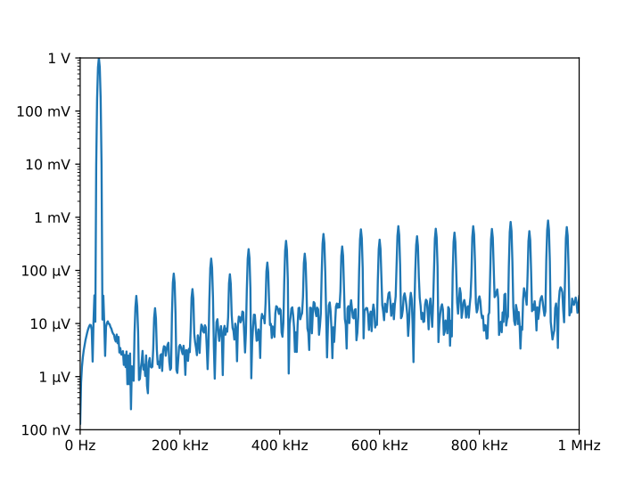

.. _examples:

Examples
========

.. _motivation example:

Motivating Example
------------------

*QuantiPhy* is a light-weight package that allows numbers to be combined with 
units into physical quantities.  Physical quantities are very commonly 
encountered when working with real-world systems when numbers are involved. And 
when encountered, the numbers often use SI scale factors to make them easier to 
read and write.  Surprisingly, most computer languages do not support numbers in 
these forms.

When working with physical quantities, one often has to choose between using 
a form that is easy for computers to read or one that is easy for humans to 
read. For example, consider this table of critical frequencies needed in jitter 
tolerance measurements in optical communication:

.. code-block:: python

    >>> table1 = """
    ...     SDH     | Rate          | f1      | f2       | f3      | f4
    ...     --------+---------------+---------+----------+---------+--------
    ...     STM-1   | 155.52 Mb/s   | 500 Hz  | 6.5 kHz  | 65 kHz  | 1.3 MHz
    ...     STM-4   | 622.08 Mb/s   | 1 kHz   | 25 kHz   | 250 kHz | 5 MHz
    ...     STM-16  | 2.48832 Gb/s  | 5 kHz   | 100 kHz  | 1 MHz   | 20 MHz
    ...     STM-64  | 9.95328 Gb/s  | 20 kHz  | 400 kHz  | 4 MHz   | 80 MHz
    ...     STM-256 | 39.81312 Gb/s | 80 kHz  | 1.92 MHz | 16 MHz  | 320 MHz
    ... """

This table was formatted to be easily read by humans. If it were formatted for 
computers, the numbers would be given without units and in exponential notation 
because they have dramatically different sizes. For example, it might look like 
this:

.. code-block:: python

    >>> table2 = """
    ...     SDH     | Rate (b/s)    | f1 (Hz) | f2 (Hz)  | f3 (Hz) | f4 (Hz)
    ...     --------+---------------+---------+----------+---------+--------
    ...     STM-1   | 1.5552e8      | 5e2     | 6.5e3    | 6.5e3   | 1.3e6
    ...     STM-4   | 6.2208e8      | 1e3     | 2.5e3    | 2.5e5   | 5e6
    ...     STM-16  | 2.48832e9     | 5e3     | 1e5      | 1e6     | 2e7
    ...     STM-64  | 9.95328e9     | 2e4     | 4e5      | 4e6     | 8e7
    ...     STM-256 | 3.981312e10   | 8e4     | 1.92e6   | 1.6e7   | 3.20e8
    ... """

This contains the same information, but it is much harder for humans to read and 
interpret.  Often the compromise of partially scaling the numbers can be used to 
make the table easier to interpret:

.. code-block:: python

    >>> table3 = """
    ...     SDH     | Rate (Mb/s)   | f1 (kHz)| f2 (kHz) | f3 (kHz)| f4 (MHz)
    ...     --------+---------------+---------+----------+---------+---------
    ...     STM-1   | 155.52        | 0.5     | 6.5      | 65      | 1.3
    ...     STM-4   | 622.08        | 1       | 2.5      | 250     | 5
    ...     STM-16  | 2488.32       | 5       | 100      | 1000    | 20
    ...     STM-64  | 9953.28       | 20      | 400      | 4000    | 80
    ...     STM-256 | 39813.12      | 80      | 1920     | 16000   | 320
    ... """

This looks cleaner, but it is still involves some effort to interpret because 
the values are distant from their corresponding scaling and units, because the 
large and small values are oddly scaled (0.5 kHz is more naturally given as 
500Hz and 39813 MHz is more naturally given as 39.8 GHz), and because each 
column may have a different scaling factor. While these might seem like minor 
inconveniences on this table, they can become quite annoying as tables become 
larger or more numerous. Fundamentally the issue is that the eyes are naturally 
drawn to the number, but the numbers are not complete, and so the eyes need to 
hunt further.  This problem exists with both tables and graphs. The scaling and 
units for the numbers may be found in the column headings, the axes, the labels, 
the title, the caption, or in the body of the text.  The sheer number of places 
to look can dramatically slow the interpretation of the data. This problem does 
not exist in the first table where each number is complete as it includes both 
its scaling and its units. The eye gets the full picture on the first glance.

This last version of the table represents a very common mistake people make when 
presenting data. They feel that adding units and scale factors to each number 
adds clutter and wastes space and so removes them from the data and places them 
somewhere else. Doing so results in a data that perhaps is visually cleaner but 
is harder for the reader to interpret.  All these tables contain the same 
information, but in the second two tables the readability has been traded off in 
order to make the data easier to read into a computer because in most languages 
there is no easy way to read numbers that have either units or scale factors.

*QuanitiPhy* makes it easy to read and generate numbers with units and scale 
factors so you do not have to choose between human and computer readability.  
For example, the above tables could be read with the following code (it must be 
tweaked somewhat to handle tables 2 and 3):

.. code-block:: python

    >>> from quantiphy import Quantity

    >>> # parse the table
    >>> sdh = []
    >>> lines = table1.strip().split('\n')
    >>> for line in lines[2:]:
    ...     fields = line.split('|')
    ...     name = fields[0].strip()
    ...     rate = Quantity(fields[1])
    ...     critical_freqs = [Quantity(f) for f in fields[2:]]
    ...     sdh.append((name, rate, critical_freqs))

    >>> # print the table in a form suitable for humans
    >>> for name, rate, freqs in sdh:
    ...     print('{:8s}: {:12s} {:9s} {:9s} {:9s} {}'.format(name, rate, *freqs))
    STM-1   : 155.52 Mb/s  500 Hz    6.5 kHz   65 kHz    1.3 MHz
    STM-4   : 622.08 Mb/s  1 kHz     25 kHz    250 kHz   5 MHz
    STM-16  : 2.4883 Gb/s  5 kHz     100 kHz   1 MHz     20 MHz
    STM-64  : 9.9533 Gb/s  20 kHz    400 kHz   4 MHz     80 MHz
    STM-256 : 39.813 Gb/s  80 kHz    1.92 MHz  16 MHz    320 MHz

    >>> # print the table in a form suitable for machines
    >>> for name, rate, freqs in sdh:
    ...     print('{:8s}: {:.4e} {:.4e} {:.4e} {:.4e} {:.4e}'.format(name, rate, *(1*f for f in freqs)))
    STM-1   : 1.5552e+08 5.0000e+02 6.5000e+03 6.5000e+04 1.3000e+06
    STM-4   : 6.2208e+08 1.0000e+03 2.5000e+04 2.5000e+05 5.0000e+06
    STM-16  : 2.4883e+09 5.0000e+03 1.0000e+05 1.0000e+06 2.0000e+07
    STM-64  : 9.9533e+09 2.0000e+04 4.0000e+05 4.0000e+06 8.0000e+07
    STM-256 : 3.9813e+10 8.0000e+04 1.9200e+06 1.6000e+07 3.2000e+08

The code first reads the data and then produces two outputs.  The first output 
shows that quantities can be displayed in easily readable forms with their units 
and the second output shows that the values are easily accessible for 
computation (the use of ``1*f`` is not necessary to be able to see the results 
in exponential notation, rather it is there to demonstrate that it is easy to do 
calculations on Quantities).

:class:`quantiphy.Quantity` is used to convert a number string, such as '155.52 
Mb/s' into an internal representation that includes the value and the units: 
155.52e6 and 'b/s'.  The scaling factor is properly interpreted. Once a value is 
converted to a *Quantity*, it can be treated just like a normal *float*. The 
main difference occurs when it is time to convert it back to a string. When 
doing so, the scale factor and units are included by default.

.. _dram:

DRAM Prices
-----------

Here is a table that was found on the Internet that gives the number of bits of 
dynamic RAM a dollar would purchase over time:

.. code-block:: python

    >>> bits_per_dollar = '''
    ...    1973 490
    ...    1978 2780
    ...    1983 16400
    ...    1988 91800
    ...    1993 368000
    ...    1998 4900000
    ...    2003 26300000
    ...    2008 143000000
    ...    2013 833000000
    ...    2018 5000000000
    ... '''

It is pretty easy to read in the early years, but by the turn of the millennium 
you have to start counting the zeros by hand to understand the number.  And are 
those bits or bytes?  Reformatting with *QuantiPhy* makes it much more readable:

.. code-block:: python

    >>> for line in bits_per_dollar.strip().split('\n'):
    ...     year, bits = line.split()
    ...     bits = Quantity(bits, 'b')
    ...     print(f'{year}    {bits:7q}    {bits:qB}')
    1973    490 b      61.25 B
    1978    2.78 kb    347.5 B
    1983    16.4 kb    2.05 kB
    1988    91.8 kb    11.475 kB
    1993    368 kb     46 kB
    1998    4.9 Mb     612.5 kB
    2003    26.3 Mb    3.2875 MB
    2008    143 Mb     17.875 MB
    2013    833 Mb     104.12 MB
    2018    5 Gb       625 MB

Notice that *bits* was printed twice. The first time the formatting code 
included a width specification, but in the second the desired unit of measure 
was specified (*B*), which caused the underlying value to be converted from bits 
to bytes.

It is important to recognize that *QuantiPhy* is using decimal rather than 
binary scale factors. So 5 GB is 5 gigabyte and not 5 gibibyte.  In otherwords 
5 GB represents 5×10⁹ B and not 5×2³⁰ B.

.. _thermal voltage example:

Thermal Voltage Example
-----------------------

In this example, quantities are used to represent all of the values used to 
compute the thermal voltage: *Vt = kT/q*. It is not terribly useful, but does 
demonstrate several of the features of *QuantiPhy*.

.. code-block:: python

    >>> from quantiphy import Quantity
    >>> with Quantity.prefs(
    ...     show_label = 'f',
    ...     label_fmt = '{n} = {v}',
    ...     label_fmt_full = '{V:<18}  # {d}',
    ... ):
    ...     T = Quantity(300, 'T K ambient temperature')
    ...     k = Quantity('k')
    ...     q = Quantity('q')
    ...     Vt = Quantity(k*T/q, f'Vt V thermal voltage at {T:q}')
    ...     print(T, k, q, Vt, sep='\n')
    T = 300 K           # ambient temperature
    k = 13.806e-24 J/K  # Boltzmann's constant
    q = 160.22e-21 C    # elementary charge
    Vt = 25.852 mV      # thermal voltage at 300 K

The first part of this example imports :class:`quantiphy.Quantity` and sets the 
*show_label*, *label_fmt* and *label_fmt_full* preferences to display both the 
value and the description by default.  *label_fmt* is used when the description 
is not present and *label_fmt_full* is used when it is present.  In *label_fmt* 
the ``{n}`` is replaced by the *name* and ``{v}`` is replaced by the value 
(numeric value and units).  In *label_fmt_full*, the ``{V:<18}`` is replaced by 
the expansion of *label_fmt*, left justified with a field width of 18, and the 
``{d}`` is replaced by the description.

The second part defines four quantities. The first is given in a very specific 
way to avoid the ambiguity between units and scale factors. In this case, the 
temperature is given in Kelvin (K), and normally if the temperature were given 
as the string '300 K', the units would be confused for the scale factor. As 
mentioned in :ref:`ambiguity` the 'K' would be treated as a scale factor unless 
you took explicit steps. In this case, this issue is circumvented by specifying 
the units in the *model* along with the name and description. The *model* is 
also used when creating *Vt* to specify the name, units, and description.

The last part simply prints the four values. The *show_label* preference is set 
so that names and descriptions are printed along with the values. In this case, 
since all the quantities have descriptions, *label_fmt_full* is used to format 
the output.

.. _unicode example:

Unicode Text Example
--------------------

In this example *QuantiPhy* formats quantities to be embedded in text.  To make 
the text as clean as possible, *QuantiPhy* is configured to use Unicode scale 
factors and the Unicode non-breaking space as the spacer.  The non-breaking 
space prevents units from being placed on a separate line from their number, 
making the quantity easier to read.

.. code-block:: python

    >>> from quantiphy import Quantity
    >>> import textwrap

    >>> Quantity.set_prefs(
    ...     map_sf = Quantity.map_sf_to_sci_notation,
    ...     spacer = Quantity.non_breaking_space
    ... )

    >>> constants = [
    ...     Quantity('h'),
    ...     Quantity('hbar'),
    ...     Quantity('k'),
    ...     Quantity('q'),
    ...     Quantity('c'),
    ...     Quantity('0C'),
    ...     Quantity('eps0'),
    ...     Quantity('mu0'),
    ... ]

    >>> # generate some sentences that contain quantities
    >>> sentences = [f'{q.desc.capitalize()} is {q}.' for q in constants]

    >>> # combine the sentences into a left justified paragraph
    >>> print(textwrap.fill('  '.join(sentences)))
    Plank's constant is 662.61×10⁻³⁶ J-s.  Reduced plank's constant is
    105.46×10⁻³⁶ J-s.  Boltzmann's constant is 13.806×10⁻²⁴ J/K.
    Elementary charge is 160.22×10⁻²¹ C.  Speed of light is 299.79 Mm/s.
    Zero degrees celsius in kelvin is 273.15 K.  Permittivity of free
    space is 8.8542 pF/m.  Permeability of free space is 1.2566 μH/m.

When rendered in your browser with a variable width font, the result looks like 
this:

    Plank's constant is 662.61×10⁻³⁶ J-s.  Reduced plank's constant is
    105.46×10⁻³⁶ J-s.  Boltzmann's constant is 13.806×10⁻²⁴ J/K.
    Elementary charge is 160.22×10⁻²¹ C.  Speed of light is 299.79 Mm/s.
    Zero degrees celsius in kelvin is 273.15 K.  Permittivity of free
    space is 8.8542 pF/m.  Permeability of free space is 1.2566 μH/m.

.. _timeit example:

Timeit Example
--------------

A Python module that benefits from *QuantiPhy* is *timeit*, a package in the 
standard library that runs a code snippet a number of times and prints the 
elapsed time for the test. However, from a usability perspective it has several 
issues. First, it prints out the elapsed time of all the repetitions rather than 
dividing the elapsed time by the number of repetitions and reporting the average 
time per operation.  So it can quickly allow you to compare the relative speed 
of various operations, but it does not directly give you a sense of the time 
required in absolute terms. Second, it does not label its output, so it is not 
clear what is being displayed.  Here is an example where *timeit* has been 
fortified with *QuantiPhy* to make the output more readable.  To make it more 
interesting, the timing results are run on *QuantiPhy* itself.  The results give 
you a feel for how much slower *QuantiPhy* is to both convert strings to 
quantities and quantities to strings compared into the built-in float class.

.. code-block:: python

    #!/usr/bin/env python3
    from timeit import timeit
    from random import random, randint
    from quantiphy import Quantity

    # preferences
    trials = 100_000
    Quantity.set_prefs(
        prec = 2,
        show_label = True,
        label_fmt = '{n:>40}: {v}',
        map_sf = Quantity.map_sf_to_greek
    )

    # build the raw data, arrays of random numbers
    s_numbers = []
    s_quantities = []
    numbers = []
    quantities = []
    for i in range(trials):
        mantissa = 20*random()-10
        exponent = randint(-35, 35)
        number = '%0.25fe%s' % (mantissa, exponent)
        quantity = number + ' Hz'
        s_numbers.append(number)
        s_quantities.append(quantity)
        numbers.append(float(number))
        quantities.append(Quantity(number, 'Hz'))

    # define testcases
    testcases = [
        '[float(v) for v in s_numbers]',
        '[Quantity(v) for v in s_quantities]',
        '[str(v) for v in numbers]',
        '[str(v) for v in quantities]',
    ]

    # run testcases and print results
    print(f'For {Quantity(trials)} values ...')
    for case in testcases:
        elapsed = timeit(case, number=1, globals=globals())
        result = Quantity(elapsed/trials, units='s/op', name=case)
        print(result)

The results are::

    For 100k iterations ...
               [float(v) for v in s_numbers]: 638 ns/op
         [Quantity(v) for v in s_quantities]: 15.3 μs/op
                   [str(v) for v in numbers]: 1.03 μs/op
                [str(v) for v in quantities]: 28.1 μs/op

You can see that *QuantiPhy* is considerably slower than the float class, which 
you should be aware of if you are processing large quantities of numbers.

Contrast this with the normal output from *timeit*::

    0.05213119700783864
    1.574107409993303
    0.10471829099697061
    2.3749650190002285

The essential information is there, but it takes longer to make sense of it.

.. _disk usage example:

Disk Usage Example
------------------

Here is a simple example that uses *QuantiPhy* to clean up the output from the 
Linux disk usage utility.  It runs the *du* command, which prints out the disk 
usage of files and directories.  The results from *du* are gathered and then 
sorted by size and then the size and name of each item is printed.

Quantity is used to scale the filesize reported by *du* from KB to B. Then the 
list of files is sorted by size. Here we are exploiting the fact that quantities 
act like floats, and so the sorting can be done with no extra effort.  Finally, 
the ability to render to a number with a scale factor and units is used when 
presenting the results.

.. code-block:: python

    #!/usr/bin/env python3
    # runs du and sorts the output while suppressing any error messages from du

    from quantiphy import Quantity
    from inform import display, fatal, os_error
    from shlib import Run
    import sys

    try:
        du = Run(['du'] + sys.argv[1:], modes='WEO1')

        files = []
        for line in du.stdout.split('\n'):
            if line:
                size, filename = line.split('\t', 1)
                files += [(Quantity(size, scale=(1000, 'B')), filename)]

        files.sort(key=lambda x: x[0])

        for each in files:
            display('{:>7.2s}  {}'.format(*each))

    except OSError as err:
        fatal(os_error(err))
    except KeyboardInterrupt:
        display('dus: killed by user.')

And here is an example of the programs output::

     460 kB  quantiphy/examples/delta-sigma
     464 kB  quantiphy/examples
    1.54 kB  quantiphy/doc
    3.48 MB  quantiphy

.. _matplotlib example:

MatPlotLib Example
------------------

In this example *QuantiPhy* is used to create easy to read axis labels in 
MatPlotLib. It uses NumPy to do a spectral analysis of a signal and then 
produces an SVG version of the results using MatPlotLib.

.. code-block:: python

    #!/usr/bin/env python3

    import numpy as np
    from numpy.fft import fft, fftfreq, fftshift
    import matplotlib as mpl
    mpl.use('SVG')
    from matplotlib.ticker import FuncFormatter
    import matplotlib.pyplot as pl
    from quantiphy import Quantity
    Quantity.set_prefs(map_sf=Quantity.map_sf_to_sci_notation)

    # read the data from delta-sigma.smpl
    data = np.fromfile('delta-sigma.smpl', sep=' ')
    time, wave = data.reshape((2, len(data)//2), order='F')

    # print out basic information about the data
    timestep = Quantity(time[1] - time[0], name='Time step', units='s')
    nonperiodicity = Quantity(wave[-1] - wave[0], name='Nonperiodicity', units='V')
    points = Quantity(len(time), name='Time points')
    period = Quantity(timestep * len(time), name='Period', units='s')
    freq_res = Quantity(1/period, name='Frequency resolution', units='Hz')
    with Quantity.prefs(show_label=True, prec=2):
        print(timestep, nonperiodicity, points, period, freq_res, sep='\n')

    # create the window
    window = np.kaiser(len(time), 11)/0.37
        # beta=11 corresponds to alpha=3.5 (beta = pi*alpha)
        # the processing gain with alpha=3.5 is 0.37
    windowed = window*wave

    # transform the data into the frequency domain
    spectrum = 2*fftshift(fft(windowed))/len(time)
    freq = fftshift(fftfreq(len(wave), timestep))

    # define the axis formatting routines
    freq_formatter = FuncFormatter(lambda v, p: str(Quantity(v, 'Hz')))
    volt_formatter = FuncFormatter(lambda v, p: str(Quantity(v, 'V')))

    # generate graphs of the resulting spectrum
    fig = pl.figure()
    ax = fig.add_subplot(111)
    ax.plot(freq, np.absolute(spectrum))
    ax.set_yscale('log')
    ax.xaxis.set_major_formatter(freq_formatter)
    ax.yaxis.set_major_formatter(volt_formatter)
    pl.savefig('spectrum.svg')
    ax.set_xlim((0, 1e6))
    ax.set_ylim((1e-7, 1))
    pl.savefig('spectrum-zoomed.svg')

This script produces the following textual output::

    Time step = 20 ns
    Nonperiodicity = 2.3 pV
    Time points = 28k
    Period = 560 μs
    Frequency resolution = 1.79 kHz

And the following is one of the two graphs produced:

Notice the axis labels in the generated graph.  Use of *QuantiPhy* makes the 
widely scaled units compact and easy to read.

MatPlotLib provides the `EngFormatter 
<https://matplotlib.org/examples/api/engineering_formatter.html>`_ that you can 
use as an alternative to *QuantiPhy* for formatting your axes with SI scale 
factors, which also provides the *format_eng* function for converting floats to 
strings formatted with SI scale factors and units. So if your needs are limited, 
as they are in this example, that is generally a good way to go. One aspect of 
*QuantiPhi* that you might prefer is the way it handles very large or very small 
numbers. As the numbers get either very large or very small *EngFormatter* 
starts by using unfamiliar scale factors (*YZPEzy*) and then reverts to 
e-notation. *QuantiPhy* allows you to control whether to use unfamiliar scale 
factors but does not use them by default. It also can be configured to revert to 
engineering scientific notation (ex: 13.806×10⁻²⁴ J/K) when no scale factors are 
appropriate.  Though not necessary for this example, that was done above with 
the line:

.. code-block:: python

    Quantity.set_prefs(map_sf=Quantity.map_sf_to_sci_notation)

.. _cryptocurrency example:

Cryptocurrency Example
----------------------

This example is displays the current price of various cryptocurrencies and the 
total value of a hypothetical portfolio of currencies. *QuantiPhy* performs 
conversions from the prices of various currencies to dollars.  The latest prices 
are downloaded from cryptocompare.com.  A summary of the prices is printed and 
then they are multiplied by the portfolio holdings to find the total worth of
the portfolio, which is also printed.

It demonstrates some of the features of *UnitConversion*.

.. code-block:: python

    #!/usr/bin/env python3

    import requests
    from textwrap import dedent
    from quantiphy import Quantity, UnitConversion

    Quantity.set_prefs(prec=2)

    # holdings
    btc = Quantity(100, 'Ƀ')
    bch = Quantity(100, 'BCH')
    eth = Quantity(100, 'Ξ')
    zec = Quantity(100, 'ZEC')
    holdings = [btc, eth, bch, zec]

    # download latest asset prices from cryptocompare.com
    currencies = dict(
        fsyms = 'BTC,ETH,BCH,ZEC',
        tsyms = 'ETH,USD',
    )
    url_args = '&'.join(f'{k}={v}' for k, v in currencies.items())
    base_url = f'https://min-api.cryptocompare.com/data/pricemulti'
    url = '?'.join([base_url, url_args])
    r = requests.get(url)
    conversions = r.json()

    # define unit conversions
    units = {
        'USD': ('$', 'USD'),
        'BTC': ('Ƀ', 'BTC'),
        'ETH': ('Ξ', 'ETH'),
        'BCH': ('BCH',    ),
        'ZEC': ('ZEC',    ),
    }
    def get_converter(fm, to):
        return UnitConversion(units[to], units[fm], conversions[fm][to])
    btc2usd = get_converter('BTC', 'USD')
    eth2usd = get_converter('ETH', 'USD')
    bch2usd = get_converter('BCH', 'USD')
    zec2usd = get_converter('ZEC', 'USD')
    btc2eth = get_converter('BTC', 'ETH')

    # sum total holdings
    total = Quantity(sum(q.scale('$') for q in holdings), '$')

    # show summary of conversions and holdings
    print(dedent(f'''
        Current Prices:
              1 BTC = {btc2usd.convert()} or {btc2eth.convert()}
              1 ETH = {eth2usd.convert()} or {btc2eth.convert(1, 'Ξ')}
              1 BCH = {bch2usd.convert()}
              1 ZEC = {zec2usd.convert()}

        Holdings:
            {btc:>7q} = {btc:q$}
            {eth:>7q} = {eth:q$}
            {bch:>7q} = {bch:q$}
            {zec:>7q} = {zec:q$}
              Total = {total:q}
    ''').strip())

The output of the script looks like this::

    Current Prices:
          1 BTC = $7.15k or Ξ24
          1 ETH = $299 or Ƀ41.7m
          1 BCH = $604
          1 ZEC = $231

    Holdings:
           Ƀ100 = $715k
           Ξ100 = $29.9k
        100 BCH = $60.4k
        100 ZEC = $23.1k
          Total = $829k
