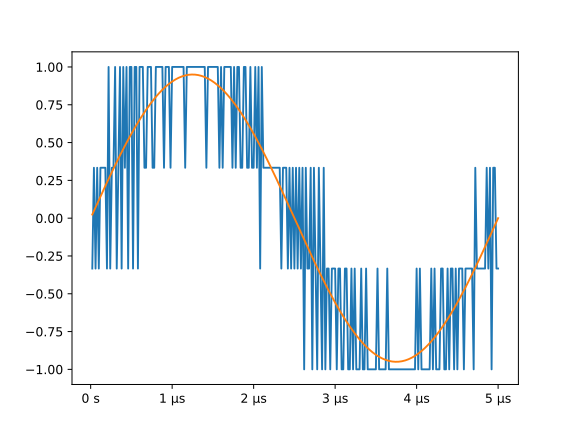
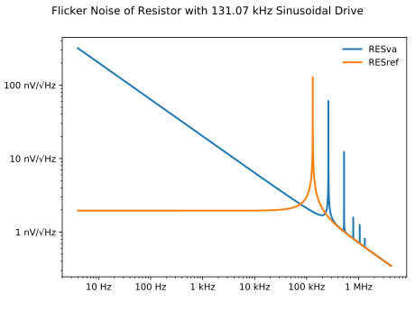

.. currentmodule:: quantiphy

..  initialization {{{1
..  Reset Quantity preferences to their original defaults.

    >>> from quantiphy import Quantity
    >>> Quantity.reset_prefs()

..  examples top level {{{1
.. _quantiphy examples:

Examples
========

.. motivating example {{{1
.. _motivation example:

Motivating Example
------------------

*QuantiPhy* is a light-weight package that allows numbers to be combined with 
units into quantities.  Quantities are very commonly encountered when working 
with real-world systems when numbers are involved. And when encountered, the 
numbers often use SI scale factors to make them easier to read and write.  
Surprisingly, most computer languages do not support numbers in this form. This 
is even more surprising when you realize that this form is a very well 
established international standard and has been for more than 50 years.

When working with quantities, one often has to choose between using a form that 
is easy for computers to read or one that is easy for humans to read. For 
example, consider this table of critical frequencies needed in jitter tolerance 
measurements in optical communication:

.. code-block:: python

    >>> table1 = """
    ...     SDH     | Rate          | f1      | f2       | f3      | f4
    ...     --------+---------------+---------+----------+---------+--------
    ...     STM-1   | 155.52 Mb/s   | 500 Hz  | 6.5 kHz  | 65 kHz  | 1.3 MHz
    ...     STM-4   | 622.08 Mb/s   | 1 kHz   | 25 kHz   | 250 kHz | 5 MHz
    ...     STM-16  | 2.48832 Gb/s  | 5 kHz   | 100 kHz  | 1 MHz   | 20 MHz
    ...     STM-64  | 9.95328 Gb/s  | 20 kHz  | 400 kHz  | 4 MHz   | 80 MHz
    ...     STM-256 | 39.81312 Gb/s | 80 kHz  | 1.92 MHz | 16 MHz  | 320 MHz
    ... """

This table was formatted to be easily read by humans. If it were formatted for 
computers, the numbers would be given without units and in exponential notation 
because they have dramatically different sizes. For example, it might look like 
this:

.. code-block:: python

    >>> table2 = """
    ...     SDH     | Rate (b/s)    | f1 (Hz) | f2 (Hz)  | f3 (Hz) | f4 (Hz)
    ...     --------+---------------+---------+----------+---------+--------
    ...     STM-1   | 1.5552e8      | 5e2     | 6.5e3    | 6.5e3   | 1.3e6
    ...     STM-4   | 6.2208e8      | 1e3     | 2.5e3    | 2.5e5   | 5e6
    ...     STM-16  | 2.48832e9     | 5e3     | 1e5      | 1e6     | 2e7
    ...     STM-64  | 9.95328e9     | 2e4     | 4e5      | 4e6     | 8e7
    ...     STM-256 | 3.981312e10   | 8e4     | 1.92e6   | 1.6e7   | 3.2e8
    ... """

This contains the same information, but it is much harder for humans to read and 
interpret.  Often the compromise of partially scaling the numbers can be used to 
make the table easier to interpret:

.. code-block:: python

    >>> table3 = """
    ...     SDH     | Rate (Mb/s)   | f1 (kHz)| f2 (kHz) | f3 (kHz)| f4 (MHz)
    ...     --------+---------------+---------+----------+---------+---------
    ...     STM-1   | 155.52        | 0.5     | 6.5      | 65      | 1.3
    ...     STM-4   | 622.08        | 1       | 2.5      | 250     | 5
    ...     STM-16  | 2488.32       | 5       | 100      | 1000    | 20
    ...     STM-64  | 9953.28       | 20      | 400      | 4000    | 80
    ...     STM-256 | 39813.12      | 80      | 1920     | 16000   | 320
    ... """

This looks cleaner, but it involves perhaps even more effort to interpret 
because the values are distant from their corresponding scaling and units, 
because the large and small values are oddly scaled (0.5 kHz is more naturally 
given as 500Hz and 39813 MHz is more naturally given as 39.8 GHz), and because 
each column may have a different scaling factor. While these might seem like 
minor inconveniences on this table, they can become quite annoying as tables 
become larger or more numerous.  This problem exists with both tables and 
graphs.  Fundamentally the issue is that your eyes are naturally drawn to the 
number, but the numbers are not complete.  Your eyes need to hunt further and it 
is not obvious where to hunt.  If not next to the number, the scaling and units 
for the numbers may be found in the column headings, the axes, the labels, the 
title, the caption, or in the body of the text.  The sheer number of places to 
look can dramatically slow the interpretation of the data.  This problem does 
not exist in the first table where each number is complete as it includes both 
its scaling and its units. The eye gets the full picture on the first glance.

This last version of the table represents a very common mistake people make when 
presenting data. They feel that adding units and scale factors to each number 
adds clutter and wastes space and so removes them from the data and places them 
somewhere else. Doing so results in a data that perhaps is visually cleaner but 
is harder for the reader to interpret.  All these tables contain the same 
information, but in the second two tables the readability has been traded off in 
order to make the data easier to read into a computer because in most languages 
there is no easy way to read numbers that have either units or scale factors.

*QuantiPhy* makes it easy to read and generate numbers with units and scale 
factors so you do not have to choose between human and computer readability.  
For example, the above tables could be read with the following code (it must be 
tweaked somewhat to handle tables 2 and 3):

.. code-block:: python

    >>> from quantiphy import Quantity

    >>> # parse the table
    >>> sdh = []
    >>> lines = table1.strip().split('\n')
    >>> for line in lines[2:]:
    ...     fields = line.split('|')
    ...     name = fields[0].strip()
    ...     rate = Quantity(fields[1])
    ...     critical_freqs = [Quantity(f) for f in fields[2:]]
    ...     sdh.append((name, rate, critical_freqs))

    >>> # print the table in a form suitable for humans
    >>> for name, rate, freqs in sdh:
    ...     print('{:8s}: {:12q} {:9q} {:9q} {:9q} {:9q}'.format(name, rate, *freqs))
    STM-1   :  155.52 Mb/s    500 Hz   6.5 kHz    65 kHz   1.3 MHz
    STM-4   :  622.08 Mb/s     1 kHz    25 kHz   250 kHz     5 MHz
    STM-16  :  2.4883 Gb/s     5 kHz   100 kHz     1 MHz    20 MHz
    STM-64  :  9.9533 Gb/s    20 kHz   400 kHz     4 MHz    80 MHz
    STM-256 :  39.813 Gb/s    80 kHz  1.92 MHz    16 MHz   320 MHz

    >>> # print the table in a form suitable for machines
    >>> for name, rate, freqs in sdh:
    ...     print('{:8s}: {:12.4e} {:9.2e} {:9.2e} {:9.2e} {:9.2e}'.format(name, rate, *freqs))
    STM-1   :   1.5552e+08     5e+02   6.5e+03   6.5e+04   1.3e+06
    STM-4   :   6.2208e+08     1e+03   2.5e+04   2.5e+05     5e+06
    STM-16  :   2.4883e+09     5e+03     1e+05     1e+06     2e+07
    STM-64  :   9.9533e+09     2e+04     4e+05     4e+06     8e+07
    STM-256 :   3.9813e+10     8e+04  1.92e+06   1.6e+07   3.2e+08

    >>> # print the table in a compromise form
    >>> for name, rate, freqs in sdh:
    ...     print(
    ...         '{:8s}: {:12.2f} {:9.1f} {:9.1f} {:9.1f} {:9.1f}'.format(
    ...             name, rate.scale(1e-6), freqs[0].scale(1e-3),
    ...             freqs[1].scale(1e-3), freqs[2].scale(1e-3), freqs[3].scale(1e-6)
    ...         )
    ...     )
    STM-1   :       155.52       0.5       6.5        65       1.3
    STM-4   :       622.08         1        25       250         5
    STM-16  :      2488.32         5       100      1000        20
    STM-64  :      9953.28        20       400      4000        80
    STM-256 :     39813.12        80      1920     16000       320

The code reads the data and then produces three outputs.  The first output shows 
that quantities can be displayed in easily readable forms with their units 
(approximates table1).  The second output shows that the values are easily 
accessible for computation (approximates table2).  Finally, the third output 
represents a compromise between being human and machine readable (approximates 
table3).

:class:`Quantity` is used to convert a number string, such as '155.52 Mb/s' into 
an internal representation that includes the value and the units: 155.52e6 and 
'b/s'.  The scaling factor is properly interpreted. Once a value is converted to 
a *Quantity*, it can be treated just like a normal *float*. The main difference 
occurs when it is time to convert it back to a string. When doing so, the scale 
factor and units are included by default.

.. dram prices {{{1
.. _dram:

DRAM Prices
-----------

Here is a table that was found on the Internet that gives the number of bits of 
dynamic RAM a dollar would purchase over time:

.. code-block:: python

    >>> bits_per_dollar = '''
    ...    1973 490
    ...    1978 2780
    ...    1983 16400
    ...    1988 91800
    ...    1993 368000
    ...    1998 4900000
    ...    2003 26300000
    ...    2008 143000000
    ...    2013 833000000
    ...    2018 5000000000
    ... '''

It is pretty easy to read in the early years, but by the turn of the millennium 
you have to start counting the zeros by hand to understand the number.  And are 
those bits or bytes?  Reformatting with *QuantiPhy* makes it much more readable:

.. code-block:: python

    >>> for line in bits_per_dollar.strip().split('\n'):
    ...     year, bits = line.split()
    ...     bits = Quantity(bits, 'b')
    ...     print(f'{year}  {bits:11.2q}   {bits:11.2qB}')
    1973        490 b        61.2 B
    1978      2.78 kb         348 B
    1983      16.4 kb       2.05 kB
    1988      91.8 kb       11.5 kB
    1993       368 kb         46 kB
    1998       4.9 Mb        612 kB
    2003      26.3 Mb       3.29 MB
    2008       143 Mb       17.9 MB
    2013       833 Mb        104 MB
    2018         5 Gb        625 MB

Notice that *bits* was printed twice. The first time the formatting code 
included a width specification, but in the second the desired unit of measure 
was specified (*B*), which caused the underlying value to be converted from bits 
to bytes.

It is important to recognize that *QuantiPhy* is using decimal rather than 
binary scale factors. So 5 GB is 5 gigabyte and not 5 gibibyte.  In other words 
5 GB represents 5×10⁹ B and not 5×2³⁰ B. This table can be reformulated to use 
the binary scale factors by changing the *q* format characters to *b*:

.. code-block:: python

    >>> for line in bits_per_dollar.strip().split('\n'):
    ...     year, bits = line.split()
    ...     bits = Quantity(bits, 'b')
    ...     print(f'{year}  {bits:11.2b}   {bits:11.2bB}')
    1973        490 b        61.2 B
    1978     2.71 Kib         348 B
    1983       16 Kib         2 KiB
    1988     89.6 Kib      11.2 KiB
    1993      359 Kib      44.9 KiB
    1998     4.67 Mib       598 KiB
    2003     25.1 Mib      3.14 MiB
    2008      136 Mib        17 MiB
    2013      794 Mib      99.3 MiB
    2018     4.66 Gib       596 MiB

.. thermal voltage example {{{1
.. _thermal voltage example:

Thermal Voltage Example
-----------------------

In this example, quantities are used to represent all of the values used to 
compute the thermal voltage: *Vt = kT/q*. It is not terribly useful, but does 
demonstrate several of the features of *QuantiPhy*.

.. code-block:: python

    >>> from quantiphy import Quantity
    >>> with Quantity.prefs(
    ...     show_label = 'f',
    ...     label_fmt = '{n} = {v}',
    ...     label_fmt_full = '{V:<18}  # {d}',
    ... ):
    ...     T = Quantity(300, 'T K ambient temperature')
    ...     k = Quantity('k')
    ...     q = Quantity('q')
    ...     Vt = Quantity(k*T/q, f'Vt V thermal voltage at {T:q}')
    ...     print(T, k, q, Vt, sep='\n')
    T = 300 K           # ambient temperature
    k = 13.806e-24 J/K  # Boltzmann's constant
    q = 160.22e-21 C    # elementary charge
    Vt = 25.852 mV      # thermal voltage at 300 K

The first part of this example imports :class:`Quantity` and sets the 
*show_label*, *label_fmt* and *label_fmt_full* preferences to display both the 
value and the description by default.  *label_fmt* is used when the description 
is not present and *label_fmt_full* is used when it is present.  In *label_fmt* 
the ``{n}`` is replaced by the *name* and ``{v}`` is replaced by the value 
(numeric value and units).  In *label_fmt_full*, the ``{V:<18}`` is replaced by 
the expansion of *label_fmt*, left justified with a field width of 18, and the 
``{d}`` is replaced by the description.

The second part defines four quantities. The first is given in a very specific 
way to avoid the ambiguity between units and scale factors. In this case, the 
temperature is given in Kelvin (K), and normally if the temperature were given 
as the string '300 K', the units would be confused for the scale factor. As 
mentioned in :ref:`ambiguity` the 'K' would be treated as a scale factor unless 
you took explicit steps. In this case, this issue is circumvented by specifying 
the units in the *model* along with the name and description. The *model* is 
also used when creating *Vt* to specify the name, units, and description.

The last part simply prints the four values. The *show_label* preference is set 
so that names and descriptions are printed along with the values. In this case, 
since all the quantities have descriptions, *label_fmt_full* is used to format 
the output.

.. casual time units example {{{1
.. _casual time units example:

Casual Time Units
-----------------

This example shows how one could allow users to enter time durations using 
a variety of casual units of time.  *QuantiPhy* only pre-defines conversions for 
time units that are unambiguous and commonly used in scientific computation, so 
that leaves out units like months and years. However, in many situations the 
goal is simplicity rather than precision. In such a situation, it is convenient 
to support any units a user may reasonably expect to use. In a casual setting it 
would be very unusual to use SI scale factors, so there use will be prohibited 
to allow a greater range of units (ex. m for minutes).

This example assumes that a collection of time duration values are contained in 
a configuration file, in this example represented by *configuration*. Normally 
these values would be contained in a separate file that is opened and read, but 
for the sake of simplicity in the example, the 'contents' of the file is just 
given as a multiline string. The user can give the durations using any units 
they like, but internally they are all converted to seconds.

.. code-block:: python

    >>> from quantiphy import Quantity, UnitConversion
    >>> _ = UnitConversion('s', 'sec second seconds')
    >>> _ = UnitConversion('s', 'm min minute minutes', 60)
    >>> _ = UnitConversion('s', 'h hr hour hours', 60*60)
    >>> _ = UnitConversion('s', 'd day days', 24*60*60)
    >>> _ = UnitConversion('s', 'w week weeks', 7*24*60*60)
    >>> _ = UnitConversion('s', 'M month months', 30*24*60*60)
    >>> _ = UnitConversion('s', 'y year years', 365*24*60*60)
    >>> Quantity.set_prefs(ignore_sf=True)

    >>> configuration = '''
    ...     time_to_live = 3 months
    ...     time_limit = 1 day
    ...     time_out = 10m
    ... '''
    >>> limits = Quantity.extract(configuration)

    >>> for k, v in limits.items():
    ...     print(f'{k} = {v:ps}')
    time_to_live = 7776000 s
    time_limit = 86400 s
    time_out = 600 s

Notice that the return values from *UnitConversion* are captured in a variable 
(`_`) in the code above.  This is not necessary. It is done in this case to 
satisfy the testing framework that tests the code found in this documentation; 
normally the return value is discarded.

Another example of using *QuantiPhy* to implement casual time units is the 
*remind* script, which reminds you to do something after a specified amount of 
time has passed. You can find `remind <https://github.com/KenKundert/remind>`_ 
on GitHub.

.. hide the following

    >>> Quantity.set_prefs(ignore_sf=None)

.. unicode example {{{1
.. _unicode example:

Unicode Text Example
--------------------

In this example *QuantiPhy* formats quantities to be embedded in text.  To make 
the text as clean as possible, *QuantiPhy* is configured to use Unicode scale 
factors and the Unicode narrow non-breaking space as the spacer.  The 
non-breaking space prevents units from being placed on a separate line from 
their number, making the quantity easier to read. The plus and minus signs are 
also replaced by their Unicode forms.

.. code-block:: python

    >>> from quantiphy import Quantity
    >>> import textwrap

    >>> Quantity.set_prefs(
    ...     map_sf = Quantity.map_sf_to_sci_notation,
    ...     spacer = Quantity.narrow_non_breaking_space,
    ...     plus = Quantity.plus_sign,
    ...     minus = Quantity.minus_sign
    ... )

    >>> constants = [
    ...     Quantity('h'),
    ...     Quantity('hbar'),
    ...     Quantity('k'),
    ...     Quantity('q'),
    ...     Quantity('c'),
    ...     Quantity('0C'),
    ...     Quantity('eps0'),
    ...     Quantity('mu0'),
    ...     Quantity('0', 'K', scale='°C', desc='Absolute zero'),
    ... ]

    >>> # generate some sentences that contain quantities
    >>> sentences = [f'{q.desc.capitalize()} is {q}.' for q in constants]

    >>> # combine the sentences into a left justified paragraph
    >>> print(textwrap.fill('  '.join(sentences)))
    Plank's constant is 662.61×10⁻³⁶ J-s.  Reduced plank's constant is
    105.46×10⁻³⁶ J-s.  Boltzmann's constant is 13.806×10⁻²⁴ J/K.
    Elementary charge is 160.22×10⁻²¹ C.  Speed of light is 299.79 Mm/s.
    Zero degrees celsius is 273.15 K.  Permittivity of free space is
    8.8542 pF/m.  Permeability of free space is 1.2566 µH/m.  Absolute
    zero is −273.15 °C.

When rendered in your browser with a variable width font, the result looks like 
this:

    Plank's constant is 662.61×10⁻³⁶ J-s.  Reduced plank's constant is
    105.46×10⁻³⁶ J-s.  Boltzmann's constant is 13.806×10⁻²⁴ J/K.
    Elementary charge is 160.22×10⁻²¹ C.  Speed of light is 299.79 Mm/s.
    Zero degrees celsius is 273.15 K.  Permittivity of free space is
    8.8542 pF/m.  Permeability of free space is 1.2566 µH/m.  Absolute
    zero is −273.15 °C.

.. timeit example {{{1
.. _timeit example:

Timeit Example
--------------

A Python module that benefits from *QuantiPhy* is *timeit*, a package in the 
standard library that runs a code snippet a number of times and prints the 
elapsed time for the test. However, from a usability perspective it has several 
issues. First, it prints out the elapsed time of all the repetitions rather than 
dividing the elapsed time by the number of repetitions and reporting the average 
time per operation.  So it can quickly allow you to compare the relative speed 
of various operations, but it does not directly give you a sense of the time 
required in absolute terms. Second, it does not label its output, so it is not 
clear what is being displayed.  Here is an example where *timeit* has been 
fortified with *QuantiPhy* to make the output more readable.  To make it more 
interesting, the timing results are run on *QuantiPhy* itself.  The results give 
you a feel for how much slower *QuantiPhy* is to both convert strings to 
quantities and quantities to strings compared into the built-in float class.

.. code-block:: python

    #!/usr/bin/env python3
    from timeit import timeit
    from random import random, randint
    from quantiphy import Quantity

    # preferences
    trials = 100_000
    Quantity.set_prefs(
        prec = 2,
        show_label = True,
        label_fmt = '{n:>40}: {v}',
        map_sf = Quantity.map_sf_to_greek
    )

    # build the raw data, arrays of random numbers
    s_numbers = []
    s_quantities = []
    numbers = []
    quantities = []
    for i in range(trials):
        mantissa = 20*random()-10
        exponent = randint(-35, 35)
        number = '%0.25fe%s' % (mantissa, exponent)
        quantity = number + ' Hz'
        s_numbers.append(number)
        s_quantities.append(quantity)
        numbers.append(float(number))
        quantities.append(Quantity(number, 'Hz'))

    # define testcases
    testcases = [
        '[float(v) for v in s_numbers]',
        '[Quantity(v) for v in s_quantities]',
        '[str(v) for v in numbers]',
        '[str(v) for v in quantities]',
    ]

    # run testcases and print results
    print(f'For {Quantity(trials)} values ...')
    for case in testcases:
        elapsed = timeit(case, number=1, globals=globals())
        result = Quantity(elapsed/trials, units='s/op', name=case)
        print(result)

The results are::

    For 100k iterations ...
               [float(v) for v in s_numbers]: 638 ns/op
         [Quantity(v) for v in s_quantities]: 15.3 µs/op
                   [str(v) for v in numbers]: 1.03 µs/op
                [str(v) for v in quantities]: 28.1 µs/op

You can see that *QuantiPhy* is considerably slower than the float class, which 
you should be aware of if you are processing large quantities of numbers.

Contrast this with the normal output from *timeit*::

    0.05213119700783864
    1.574107409993303
    0.10471829099697061
    2.3749650190002285

The essential information is there, but it takes longer to make sense of it.

.. disk usage example {{{1
.. _disk usage example:

Disk Usage Example
------------------

Here is a simple example that uses *QuantiPhy* to clean up the output from the 
Linux disk usage utility.  It runs the *du* command, which prints out the disk 
usage of files and directories.  The results from *du* are gathered and then 
sorted by size and then the size and name of each item is printed.

Quantity is used to scale the filesize reported by *du* from KB to B. Then the 
list of files is sorted by size. Here we are exploiting the fact that quantities 
act like floats, and so the sorting can be done with no extra effort.  Finally, 
the ability to render to a number with a scale factor and units is used when 
presenting the results.

.. code-block:: python

    #!/usr/bin/env python3
    # runs du and sorts the output while suppressing any error messages from du

    from quantiphy import Quantity
    from inform import display, fatal, os_error
    from shlib import Run
    import sys

    try:
        du = Run(['du', '-xd1'] + sys.argv[1:], modes='sWEO1')

        files = []
        for line in du.stdout.splitlines():
            if line:
                size, _, filename = line.partition('\t')
                files += [(Quantity(size, scale=(1024, 'B')), filename)]

        files.sort(key=lambda x: x[0])

        for size, name in files:
            display('{:8.2b}  {}'.format(size, name))

    except OSError as err:
        fatal(os_error(err))
    except KeyboardInterrupt:
        display('dus: killed by user.')

And here is an example of the programs output::

     460 KiB  quantiphy/examples/delta-sigma
     464 KiB  quantiphy/examples
    1.54 KiB  quantiphy/doc
    3.48 MiB  quantiphy

.. simulation example {{{1
.. _simulation example:

Parameterized Simulation Example
--------------------------------

In this example, Python is used to perform a simulation of a ΔΣ modulator. There 
are a collection of parameters that control the simulation, which are placed at 
the top of the Python file as documentation. :meth:`Quantity.extract` is used to 
access these parameters and control the simulation. In this way, modifying the 
simulation parameters is easy and the documentation is always up to date.

.. code-block:: python

    #!/usr/bin/env python3

    r"""
    Simulates a second-order ΔΣ modulator with the following parameter values:

        Fclk = 50MHz            -- clock frequency
        Fin = 200kHz            -- input frequency
        Vin = 950mV             -- input voltage amplitude (peak)
        gain1 = 0.5             -- gain of first integrator
        gain2 = 0.5             -- gain of second integrator
        Vmax = 1V               -- quantizer maximum input voltage
        Vmin = -1V              -- quantizer minimum input voltage
        # levels = 16             -- quantizer output levels
        levels = 4              -- quantizer output levels
        Tstop = 1/Fin "s"       -- simulation stop time
        Tstart = -0.5/Fin "s"   -- simulation start time (points with t<0 are discarded)
        vin_file = 'vin.wave'   -- output data file for vin
        vout_file = 'vout.wave' -- output data file for vout
        dout_file = 'dout.wave' -- output data file for dout
    """
    # The values given above are used in the simulation, no further modification 
    # of the code given below is required when changing these parameters.

    from quantiphy import Quantity
    from math import sin, tau
    from inform import display, error, os_error

    class Integrator:
        def __init__(self, gain=1):
            self.state = 0
            self.gain = gain

        def update(self, vin):
            self.state += self.gain*vin
            return self.state

    class Quantizer:
        def __init__(self, v_max, v_min, levels):
            self.v_min = v_min
            self.levels = levels
            self.delta = (v_max - v_min)/(levels - 1)

        def update(self, v_in):
            level = (v_in - self.v_min) // self.delta
            level = 0 if level < 0 else level
            level = self.levels-1 if level >= self.levels else level
            return int(level), self.delta*level + self.v_min

    class Source:
        def __init__(self, f_in, amp):
            self.omega = tau*f_in
            self.amp = amp

        def update(self, t):
            return self.amp*sin(self.omega*t)

    # read simulation parameters and load into module namespace
    parameters = Quantity.extract(__doc__)
    globals().update(parameters)

    # display the simulation parameters
    display('Simulation parameters:')
    for k, v in parameters.items():
        try:
            display(f'   ', v.render(show_label='f'))
        except AttributeError:
            display(f'    {k} = {v}')

    # instantiate components
    integrator1 = Integrator(gain1)
    integrator2 = Integrator(gain2)
    quantizer = Quantizer(Vmax, Vmin, levels)
    sine = Source(Fin, Vin)

    # run simulation
    t = Tstart
    dt = 1/Fclk
    v_out = 0
    t_stop = Tstop
    try:
        fvin = open(vin_file, 'w')
        fvout = open(vout_file, 'w')
        fdout = open(dout_file, 'w')
        while t < t_stop:
            v_in = sine.update(t)
            v_int1 = integrator1.update(v_in - v_out)
            v_int2 = integrator2.update(v_int1 - v_out)
            d_out, v_out = quantizer.update(v_int2)
            if (t >= 0):
                print(t, v_in, file=fvin)
                print(t, v_out, file=fvout)
                print(t, d_out, file=fdout)
            t += dt
    except OSError as e:
        error(os_error(e))

Notice that *levels* was specified twice, but the first proceeded by `#` causing 
it to be ignored.

The output of this example can be used as the input to the next. With these 
parameters, it produces this waveform:

.. matplotlib example {{{1
.. _matplotlib example:

.. index::
   single: matplotlib

MatPlotLib Example
------------------

In this example *QuantiPhy* is used to create easy to read axis labels in 
MatPlotLib. It uses NumPy to do a spectral analysis of a signal and then 
produces an SVG version of the results using MatPlotLib.

.. code-block:: python

    #!/usr/bin/env python3

    import numpy as np
    from numpy.fft import fft, fftfreq, fftshift
    import matplotlib as mpl
    mpl.use('SVG')
    from matplotlib.ticker import FuncFormatter
    import matplotlib.pyplot as pl
    from quantiphy import Quantity
    Quantity.set_prefs(map_sf=Quantity.map_sf_to_sci_notation)

    # read the data from delta-sigma.smpl
    data = np.fromfile('delta-sigma.smpl', sep=' ')
    time, wave = data.reshape((2, len(data)//2), order='F')

    # print out basic information about the data
    timestep = Quantity(time[1] - time[0], name='Time step', units='s')
    nonperiodicity = Quantity(wave[-1] - wave[0], name='Nonperiodicity', units='V')
    points = Quantity(len(time), name='Time points')
    period = Quantity(timestep * len(time), name='Period', units='s')
    freq_res = Quantity(1/period, name='Frequency resolution', units='Hz')
    with Quantity.prefs(show_label=True, prec=2):
        print(timestep, nonperiodicity, points, period, freq_res, sep='\n')

    # create the window
    window = np.kaiser(len(time), 11)/0.37
        # beta=11 corresponds to alpha=3.5 (beta = pi*alpha)
        # the processing gain with alpha=3.5 is 0.37
    windowed = window*wave

    # transform the data into the frequency domain
    spectrum = 2*fftshift(fft(windowed))/len(time)
    freq = fftshift(fftfreq(len(wave), timestep))

    # define the axis formatting routines
    freq_formatter = FuncFormatter(lambda v, p: str(Quantity(v, 'Hz')))
    volt_formatter = FuncFormatter(lambda v, p: str(Quantity(v, 'V')))

    # generate graphs of the resulting spectrum
    fig = pl.figure()
    ax = fig.add_subplot(111)
    ax.plot(freq, np.absolute(spectrum))
    ax.set_yscale('log')
    ax.xaxis.set_major_formatter(freq_formatter)
    ax.yaxis.set_major_formatter(volt_formatter)
    pl.savefig('spectrum.svg')
    ax.set_xlim((0, 1e6))
    ax.set_ylim((1e-7, 1))
    pl.savefig('spectrum-zoomed.svg')

This script produces the following textual output::

    Time step = 20 ns
    Nonperiodicity = 2.3 pV
    Time points = 28k
    Period = 560 µs
    Frequency resolution = 1.79 kHz

And the following is one of the two graphs produced:

..  image:: spectrum-zoomed.png

Notice the axis labels in the generated graph.  Use of *QuantiPhy* makes the 
widely scaled units compact and easy to read.

MatPlotLib provides the `EngFormatter 
<https://matplotlib.org/examples/api/engineering_formatter.html>`_ that you can 
use as an alternative to *QuantiPhy* for formatting your axes with SI scale 
factors, which also provides the *format_eng* function for converting floats to 
strings formatted with SI scale factors and units. So if your needs are limited, 
as they are in this example, that is generally a good way to go. One aspect of 
*QuantiPhy* that you might prefer is the way it handles very large or very small 
numbers. As the numbers get either very large or very small *EngFormatter* 
starts by using unfamiliar scale factors (*YZPEzy*) and then reverts to 
e-notation. *QuantiPhy* allows you to control whether to use unfamiliar scale 
factors but does not use them by default. It also can be configured to revert to 
engineering scientific notation (ex: 13.806×10⁻²⁴ J/K) when no scale factors are 
appropriate.  Though not necessary for this example, that was done above with 
the line:

.. code-block:: python

    Quantity.set_prefs(map_sf=Quantity.map_sf_to_sci_notation)

.. flicker-noise example {{{1
.. _flicker-noise example:

.. index::
   single: Flicker Noise

Flicker Noise
-------------

This example represents a very typical use of *QuantiPhy* in a simulation 
script.  As in the two previous examples, it includes both extraction of 
simulation parameters from the script's documentation and attractive formatting 
of units in MatPlotLib graphs.  It is a bit long and you cannot run it yourself 
as it requires access to a proprietary circuit simulator, and as such the code 
is not included here.  But it is an excellent example of how to use *QuantiPhy* 
in a variety of ways.  You can find the `Flicker Noise code 
<https://github.com/KenKundert/flicker-noise>`_ on GitHub.  It produces results 
like the following:

.. cryptocurrency example {{{1
.. _quantiphy cryptocurrency example:

Cryptocurrency Example
----------------------

This example displays the current price of various cryptocurrencies and the 
total value of a hypothetical portfolio of currencies. *QuantiPhy* performs 
conversions from the prices of various currencies to dollars.  The latest prices 
are downloaded from cryptocompare.com.  A summary of the prices is printed and 
then they are multiplied by the portfolio holdings to find the total worth of
the portfolio, which is also printed.

It demonstrates some of the features of *UnitConversion*.

.. code-block:: python

    #!/usr/bin/env python3

    import requests
    from inform import display, fatal, os_error, terminate
    from quantiphy import Quantity, UnitConversion, InvalidNumber
    Quantity.set_prefs(prec=2)

    # read holdings
    try:
        with open('holdings') as f:
            lines = f.read().splitlines()
        holdings = {
            q.units: q for q in [
                Quantity(l, ignore_sf=True) for l in lines if l
            ]
        }
    except OSError as e:
        fatal(os_error(e))
    except InvalidNumber as e:
        fatal(e)

    # download latest asset prices from cryptocompare.com
    currencies = dict(
        fsyms = ','.join(holdings.keys()),  # from symbols
        tsyms = 'USD',                      # to symbols
    )
    url_args = '&'.join(f'{k}={v}' for k, v in currencies.items())
    base_url = f'https://min-api.cryptocompare.com/data/pricemulti'
    url = '?'.join([base_url, url_args])
    try:
        response = requests.get(url)
    except KeyboardInterrupt:
        terminate('Killed by user.)
    except Exception as e:
        fatal('cannot connect to cryptocompare.com.')
    conversions = response.json()

    # define unit conversions
    converters = {
        sym: UnitConversion(('$', 'USD'), sym, conversions[sym]['USD'])
        for sym in holdings
    }

    # sum total holdings
    total = Quantity(sum(q.scale('$') for q in holdings.values()), '$')

    # show summary of holdings and conversions
    for sym, q in holdings.items():
        value = f'{q:>9q} = {q:<7q$} {100*q.scale("$")/total:.0f}%'
        price = f'1 {sym} = {converters[sym].convert()}'
        display(f'{value:<25s} ({price})')
    display(f'    Total = {total:q}')

This script reads a file 'holdings' that contains the number of tokens you hold 
of each of your cryptocurrencies.  That file would contain one currency per line 
and look like this::

    10 BTC
    100 ETH
    100 BCH
    100 ZEC
    10,000 EOS
    100,000 ADA

The output of the script looks like this::

      10 BTC = $65.8k  30%   (1 BTC = $6.58k)
     100 ETH = $22.4k  10%   (1 ETH = $224)
     100 BCH = $51.5k  24%   (1 BCH = $515)
     100 ZEC = $12.7k  6%    (1 ZEC = $127)
     10 kEOS = $57.6k  26%   (1 EOS = $5.76)
    100 kADA = $8.16k  4%    (1 ADA = $81.6m)
       Total = $218k

If you prefer the output in fixed-point format, you can replace the last part of 
this code with:

.. code-block:: python

    # show summary of holdings and conversions
    for sym, q in holdings.items():
        value = f'{q:>10.2p} = {q:>#11,.2p$}  {100*q.scale("$")/total:,.0f}%'
        price = f'1 {sym} = {converters[sym].convert():>#9,.2p}'
        display(f'{value:<30s} ({price})')
    display(f'     Total = {total:>#11,.2p}')

If you do, the output of the script looks like this::

        10 BTC =  $65,847.10  30%  (1 BTC = $6,584.71)
       100 ETH =  $22,401.00  10%  (1 ETH =   $224.01)
       100 BCH =  $51,450.00  24%  (1 BCH =   $514.50)
       100 ZEC =  $12,726.00  6%   (1 ZEC =   $127.26)
     10000 EOS =  $57,600.00  26%  (1 EOS =     $5.76)
    100000 ADA =   $8,203.00  4%   (1 ADA =     $0.08)
         Total = $218,227.10

A more sophisticated version of `cryptocurrency 
<https://github.com/KenKundert/cryptocurrency/blob/master/cryptocurrency>`_
this example can be found on GitHub.

.. bitcoin example {{{1
.. _quantiphy bitcoin example:

Dynamic Unit Conversions
------------------------

Normally unit conversions are static, meaning that once the conversion values 
are set they do not change during the life of the process.  However, that need 
not be true if functions are used to perform the conversion.  In the following 
example, the current price of Bitcoin is queried from a price service and used 
in the conversion.  The price service is queried each time a conversion is 
performed, so it is always up-to-date, no matter how long the program runs.

.. code-block:: python

    #!/usr/bin/env python3

    # Bitcoin
    # This example demonstrates how to use UnitConversion to convert between 
    # bitcoin and dollars at the current price.

    from quantiphy import Quantity, UnitConversion
    import requests

    # get the current bitcoin price from coingecko.com
    url = 'https://api.coingecko.com/api/v3/simple/price'
    params = dict(ids='bitcoin', vs_currencies='usd')
    def get_btc_price():
        try:
            resp = requests.get(url=url, params=params)
            prices = resp.json()
            return prices['bitcoin']['usd']
        except Exception as e:
            print('error: cannot connect to coingecko.com.')

    # use UnitConversion from QuantiPhy to perform the conversion
    bitcoin_units = ['BTC', 'btc', 'Ƀ', '₿']
    satoshi_units = ['sat', 'sats', 'ș']
    dollar_units = ['USD', 'usd', '$']
    UnitConversion(
        dollar_units, bitcoin_units,
        lambda b: b*get_btc_price(), lambda d: d/get_btc_price()
    )
    UnitConversion(satoshi_units, bitcoin_units, 1e8)
    UnitConversion(
        dollar_units, satoshi_units,
        lambda s: s*get_btc_price()/1e8, lambda d: d/(get_btc_price()/1e8),
    )

    unit_btc = Quantity('1 BTC')
    unit_dollar = Quantity('$1')

    print(f'{unit_btc:>8,.2p} = {unit_btc:,.2p$}')
    print(f'{unit_dollar:>8,.2p} = {unit_dollar:,.0psat}')

When run, the script prints something like this::

   1 BTC = $17,211.91
      $1 = 5,810 sat

.. pluralize example {{{1
.. _quantiphy pluralize example:

Pluralize
---------

Using some external packages you can monkey patch a new method into *Quantity* 
that converts quantities into the singular or plural forms of speech.

.. ignore:

    >>> Quantity.set_prefs(spacer=' ')

.. code-block:: python

    >>> from quantiphy import Quantity
    >>> from inform import plural

    >>> def pluralize(self):
    ...     with self.prefs(form='fixed', show_units=False):
    ...         return plural(self).format(self.plural_format)

    >>> class Loaves(Quantity):
    ...     units = 'loaves'
    ...     plural_format = "# /loaf/loaves"
    ...     pluralize = pluralize

    >>> with Quantity.prefs(form='fixed'):
    ...     for count in [0, 1, 2, 0.5]:
    ...         q = Loaves(count)
    ...         print(q, '->', q.pluralize())
    0 loaves -> 0 loaves
    1 loaves -> 1 loaf
    2 loaves -> 2 loaves
    0.5 loaves -> 0.5 loaves
